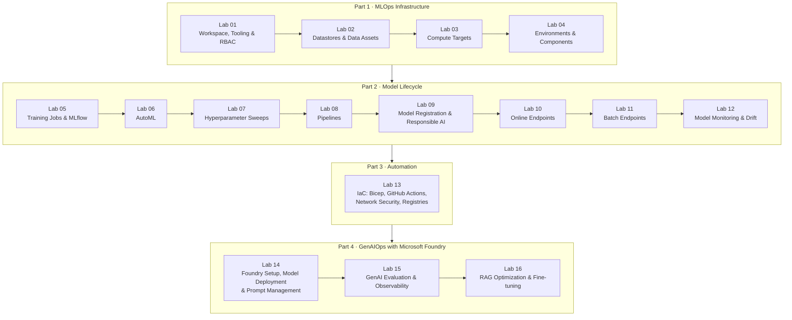

# LetsAML — Hands-on Labs for Exam AI-300

A complete, self-paced lab series for **Exam AI-300: Operationalizing Machine Learning and Generative AI Solutions** — the exam behind the **Microsoft Certified: Machine Learning Operations (MLOps) Engineer Associate** certification (successor to DP-100).

Every lab is a standalone markdown file that explains the *concept* first, then walks through the *steps* using the current tooling: **Azure ML CLI v2 (`az ml`)**, **Python SDK v2 (`azure-ai-ml`)**, **MLflow**, and **Microsoft Foundry**. Labs assume you already have an Azure ML workspace deployed.

## How the exam is structured

| Domain | Weight | Labs |
|---|---|---|
| Design and implement an MLOps infrastructure | 15–20% | 01, 02, 03, 04, 13 |
| Implement ML model lifecycle and operations | 25–30% | 05, 06, 07, 08, 09, 10, 11, 12 |
| Design and implement a GenAIOps infrastructure | 20–25% | 14 |
| Implement generative AI quality assurance and observability | 10–15% | 15 |
| Optimize generative AI systems and model performance | 10–15% | 16 |

Official study guide: <https://learn.microsoft.com/credentials/certifications/resources/study-guides/ai-300>

## Learning path



## Repository layout

```
LetsAML/
├── README.md                  ← you are here
├── labs/                      ← one markdown file per lab
├── data/
│   ├── generate_data.py       ← reproduces the synthetic datasets
│   ├── diabetes.csv           ← 5,000-row training dataset (binary classification)
│   ├── diabetes-drift.csv     ← 2,000-row drifted dataset (for Lab 12)
│   ├── diabetes-mltable/      ← MLTable data asset definition (for Lab 02)
│   ├── sample-request.json    ← test payload for online endpoints (Lab 10)
│   └── eval/qa-eval.jsonl     ← evaluation dataset for GenAI labs (Lab 15)
└── src/
    ├── train.py               ← training script used by Labs 05, 07, 08
    ├── conda-env.yml          ← custom environment spec (Lab 04)
    └── components/            ← pipeline component specs + scripts (Labs 04, 08)
```

## The scenario used throughout

You work for a healthcare provider building a **diabetes-risk prediction service**. The classic-ML labs (01–13) train, deploy, monitor, and automate that model. The GenAI labs (14–16) add a patient-facing Q&A assistant grounded in medical guidance, taking it through deployment, evaluation, observability, and RAG optimization on Microsoft Foundry.

## Prerequisites

- An **Azure subscription** with an **Azure ML workspace** already deployed (you have this).
- **Owner** or **Contributor** + **User Access Administrator** on the resource group (needed for RBAC and IaC labs).
- Azure CLI ≥ 2.60 with the `ml` extension, Python ≥ 3.10 — installed in [Lab 01](labs/lab-01-workspace-tooling-and-rbac.md).
- Quota for at least 2 vCPUs of `Standard_DS11_v2` (or similar) compute in your region.

## Cost guardrails

Everything in these labs runs on minimal SKUs, but four things bill while they exist even when idle — delete them when a lab tells you to:

1. **Compute instances** (stop or delete; Lab 03 sets an auto-shutdown schedule)
2. **Online endpoints / deployments** (Lab 10 — delete at the end)
3. **Provisioned model deployments in Foundry** (Lab 14)
4. **Azure AI Search** (Lab 16 — use the Free/Basic tier, delete after)

Compute *clusters* with `min_instances: 0` scale to zero and cost nothing while idle.

## Start here

→ [Lab 01 — Workspace, Tooling & RBAC](labs/lab-01-workspace-tooling-and-rbac.md)
