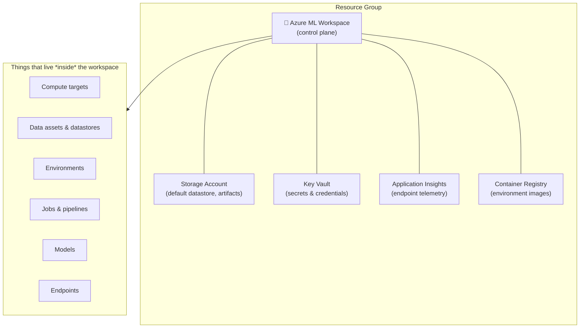

# Lab 01 — Workspace Anatomy, Tooling Setup & Access Control

**Exam mapping:** *Design and implement an MLOps infrastructure* → "Create and manage a workspace", "Configure identity and access management for workspaces"

**Time:** ~45 minutes | **Cost:** none (no compute created)

---

## 1. Concepts

### 1.1 What a workspace actually is

An Azure ML **workspace** is the top-level Azure resource for machine learning. It is *not* where your data or compute physically lives — it is a **control plane** that stitches together a set of associated Azure resources and gives you a single place to track everything (jobs, models, endpoints, data assets).

When your workspace was deployed, Azure created (or linked) four associated resources:

| Resource | Role in the workspace |
|---|---|
| **Storage account** | Default datastore. Job outputs, logged artifacts, notebooks, and uploaded data land here. |
| **Key Vault** | Stores workspace secrets: datastore credentials, connection strings. |
| **Application Insights** | Collects telemetry from deployed endpoints (request rates, latency, failures). |
| **Container Registry (ACR)** | Stores the Docker images Azure ML builds for your environments. Created *lazily* — only on the first image build if it didn't exist. |



> **Exam point:** know which associated resource holds what. "Where do logged metrics/artifacts go?" → the storage account. "Where are datastore credentials kept?" → Key Vault. "Where do endpoint logs go?" → Application Insights.

### 1.2 Three ways to work with the workspace

| Interface | When to use | Exam relevance |
|---|---|---|
| **Azure ML Studio** (https://ml.azure.com) | Exploration, visual inspection of jobs/metrics, one-off tasks | Know your way around, but the exam favors code |
| **CLI v2** (`az ml ...` + YAML files) | CI/CD, IaC, repeatable operations | Heavily tested — YAML schemas matter |
| **Python SDK v2** (`azure-ai-ml` package, `MLClient` class) | Notebooks, scripted workflows, pipelines | Heavily tested |

Everything in Azure ML is declarative: a job, an environment, an endpoint are all just **YAML documents** (CLI) or **objects** (SDK) submitted to the same ARM-backed API. The v1 SDK (`azureml-core`) and CLI v1 (`az ml` with `-w` flags) are legacy — the exam tests **v2 only**.

### 1.3 Identity and access management

Two distinct identity questions, don't conflate them:

1. **Who can do what *to* the workspace?** → Azure **RBAC** roles assigned on the workspace (or resource group) scope:
   - **Reader** – view everything, change nothing.
   - **AzureML Data Scientist** – run jobs, register models, create endpoints... but **cannot** create/modify compute or workspace settings.
   - **AzureML Compute Operator** – create, manage, and access compute resources.
   - **Contributor / Owner** – full control (Owner can also assign roles).
2. **What can the workspace and its compute do *to other resources*?** → **Managed identities**. The workspace has a system-assigned identity used to access its associated resources; compute clusters can carry identities so training jobs can pull data from other services without credentials.

> **Exam point:** "A data scientist needs to submit training jobs but must not be able to create compute" → assign **AzureML Data Scientist**, and have an admin (or someone with **AzureML Compute Operator**) pre-create the compute.

---

## 2. Steps

### Step 1 — Install the tooling

```bash
# Azure CLI (macOS; see docs for other platforms)
brew update && brew install azure-cli

# The ML extension provides all `az ml` commands
az extension add -n ml
az extension update -n ml   # if it was already installed

# Verify — should print 2.x
az extension show -n ml --query version -o tsv
```

Create a Python virtual environment for the SDK labs:

> **Use Python 3.12 or older.** The Azure ML stack lags behind new Python releases — `pandas~=2.2.0` and `scikit-learn~=1.5.0` ship pre-built wheels only up to Python 3.13. On Python 3.14 pip falls back to compiling them from source, which takes many minutes. On macOS: `brew install python@3.12`, then use `python3.12` below.

```bash
cd ~/PycharmProjects/LetsAML
python3.12 -m venv .venv
source .venv/bin/activate
python -m pip install azure-ai-ml azure-identity "mlflow~=2.19.0" azureml-mlflow \
  "pandas~=2.2.0" "scikit-learn~=1.5.0"
```

> **`mltable` is deliberately not in that list — on Apple Silicon it cannot be installed.** The package pulls in `azureml-dataprep-rslex`, a compiled extension that Microsoft publishes only for Linux (x86_64/aarch64), Windows, and **Intel** macOS. There is no `macosx_arm64` wheel for any version, so `pip install mltable` on an M-series Mac fails with `No matching distribution found`. It also pins `azure-identity<=1.17.0`, which conflicts with the version `azure-ai-ml` needs and sends pip into a long backtracking loop before it gives up.
>
> This blocks exactly one step in these labs: **Lab 02 Step 5**, which calls `mltable.load()` to materialize a table into pandas locally. Everywhere else (`type: mltable` in YAML, `AssetTypes.MLTABLE` in the SDK, AutoML inputs in Lab 06, monitoring inputs in Lab 12) `mltable` is just an *asset-type string* sent to Azure — `azure-ai-ml` handles it, and the parsing happens on the compute target, not your laptop. Creating and consuming MLTable assets works fine.
>
> If you need Lab 02 Step 5 locally, run it on a compute instance in the workspace, or read the underlying CSV with pandas directly and treat the typed-schema output as read-only reference.

### Step 2 — Sign in and set defaults

```bash
az login
az account set --subscription "<your-subscription-name-or-id>"

# Set defaults so every `az ml` command doesn't need -g/-w flags
az configure --defaults group=<your-resource-group> workspace=<your-workspace-name>
```

### Step 3 — Inspect your existing workspace

```bash
az ml workspace show
```

Read the output deliberately — find these fields and connect them to §1.1:

- `storage_account`, `key_vault`, `application_insights`, `container_registry` → the associated resources (ARM IDs).
- `identity.type: SystemAssigned` → the workspace's managed identity.
- `public_network_access: Enabled` → we lock this down in Lab 13.
- `discovery_url` / `mlflow_tracking_uri` → the regional API endpoint and MLflow tracking endpoint (Lab 05 uses the latter).

### Step 4 — Connect with the SDK

Create `check_connection.py` in the repo root:

```python
from azure.ai.ml import MLClient
from azure.identity import DefaultAzureCredential

# DefaultAzureCredential tries, in order: environment variables, managed
# identity, Azure CLI login, interactive browser. On your laptop it will
# reuse your `az login` session.
ml_client = MLClient(
    credential=DefaultAzureCredential(),
    subscription_id="<subscription-id>",
    resource_group_name="<resource-group>",
    workspace_name="<workspace-name>",
)

ws = ml_client.workspaces.get(ml_client.workspace_name)
print(f"Connected to: {ws.name} ({ws.location})")
print(f"MLflow tracking URI: {ws.mlflow_tracking_uri}")
```

```bash
python check_connection.py
```

> **Concept:** `MLClient` is the single entry point of SDK v2. Every asset type hangs off it as a collection: `ml_client.jobs`, `ml_client.models`, `ml_client.data`, `ml_client.environments`, `ml_client.compute`, `ml_client.online_endpoints`... each with `list()`, `get()`, and `create_or_update()` methods. Learn this shape once and you know the whole SDK.

You can avoid hardcoding IDs with a config file. Download `config.json` from the portal (workspace overview → *Download config.json*) into the repo root, then:

```python
ml_client = MLClient.from_config(credential=DefaultAzureCredential())
```

### Step 5 — Tour the Studio

Open <https://ml.azure.com>, select your workspace, and locate each section in the left nav — you'll use all of them in later labs:

- **Authoring:** Notebooks, AutoML, Designer
- **Assets:** Data, Jobs, Components, Pipelines, Environments, Models, Endpoints
- **Manage:** Compute, Monitoring, Linked services

### Step 6 — Examine RBAC assignments

```bash
# Who has access to the workspace?
WS_ID=$(az ml workspace show --query id -o tsv)
az role assignment list --scope $WS_ID -o table

# Inspect the built-in AzureML Data Scientist role definition —
# note the NotActions excluding compute write operations
az role definition list --name "AzureML Data Scientist" \
  --query '[0].permissions[0].{actions:actions, notActions:notActions}'
```

If you have a second account (or a colleague) to test with, grant scoped access:

```bash
az role assignment create \
  --assignee "someone@example.com" \
  --role "AzureML Data Scientist" \
  --scope $WS_ID
```

Otherwise, just study the role definition output — the exam asks *which role* fits a scenario, not the command syntax.

### Step 7 — Look at the workspace's managed identity

```bash
az ml workspace show --query identity
```

Then in the Azure portal: your storage account → **Access control (IAM)** → **Role assignments** — find the workspace identity holding roles like *Storage Blob Data Contributor*. This is *how* the workspace reads/writes the default datastore without stored keys (when configured for identity-based access).

---

## 3. Verify

- [ ] `az ml workspace show` returns your workspace with all four associated resources
- [ ] `python check_connection.py` prints the workspace name and MLflow URI
- [ ] You can name the role that permits job submission but not compute creation

## 4. Key takeaways

1. The workspace is a **control plane**; artifacts live in the associated storage account, secrets in Key Vault, telemetry in App Insights, images in ACR.
2. **CLI v2 + YAML** and **SDK v2 (`MLClient`)** are the current tooling; v1 is legacy and not on the exam.
3. RBAC answers *who can act on the workspace*; managed identities answer *what the workspace/compute can access*.

## 5. Docs

- [How Azure ML works: architecture](https://learn.microsoft.com/azure/machine-learning/concept-azure-machine-learning-v2)
- [Install and set up CLI v2](https://learn.microsoft.com/azure/machine-learning/how-to-configure-cli)
- [Manage access to Azure ML](https://learn.microsoft.com/azure/machine-learning/how-to-assign-roles)
- [Workspace managed identities](https://learn.microsoft.com/azure/machine-learning/how-to-identity-based-service-authentication)

**Next:** [Lab 02 — Datastores & Data Assets](lab-02-datastores-and-data-assets.md)
