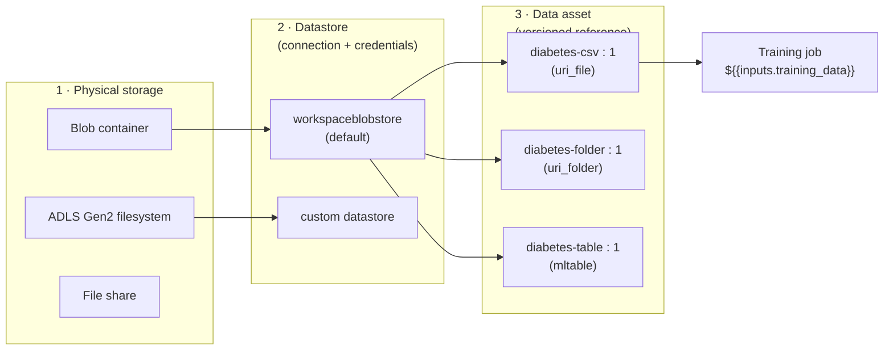

# Lab 02 — Datastores & Data Assets

**Exam mapping:** *Design and implement an MLOps infrastructure* → "Create and manage datastores", "Create and manage data assets"

**Time:** ~60 minutes | **Cost:** pennies of blob storage

**Prerequisites:** Lab 01 completed (CLI + SDK connected, defaults set). Run all commands from the repo root (`~/PycharmProjects/LetsAML`).

---

## 1. Concepts

### 1.1 The three layers of data access

Azure ML separates *where data physically is*, *how the workspace connects to it*, and *what your jobs consume*:



- A **datastore** stores the *connection information* (endpoint + credentials or identity) for a storage service, keeping secrets out of your scripts. Credentials live in the workspace Key Vault.
- A **data asset** is a *versioned, named pointer* to specific data reachable through a datastore (or any URI). Assets give you reproducibility: "model v3 was trained on `diabetes-csv:2`".
- Jobs never care where data is — they receive a **mounted or downloaded path** at runtime.

### 1.2 Datastore authentication options

| Method | How it works | When |
|---|---|---|
| **Credential-based** | Account key or SAS token stored in Key Vault | Quick start, legacy |
| **Identity-based** | Your Microsoft Entra identity (interactive) or the compute's managed identity (jobs) is used at access time | Recommended; nothing secret is stored |

> **Exam point:** identity-based access requires the identity to hold **Storage Blob Data Reader/Contributor** on the storage account — RBAC on the *data plane*, not just Reader on the resource.

### 1.3 Data asset types

| Type | Points to | Consumed as | Use when |
|---|---|---|---|
| `uri_file` | One file | path to a file | Single CSV/parquet |
| `uri_folder` | A folder | path to a directory | Many files, images, partitioned data |
| `mltable` | A folder containing an `MLTable` YAML "blueprint" + data | materialized dataframe | Tabular data with schema/transform logic; **required for AutoML** |

An **MLTable** file declares *how to read* the data (delimiter, headers, type conversions, glob patterns) so every consumer parses it identically. Look at `data/diabetes-mltable/MLTable` in this repo — that's a complete example.

### 1.4 URIs

Everything is addressed by URI. Recognize these formats:

```
azureml:diabetes-csv:1                                  # data asset name:version
azureml://datastores/workspaceblobstore/paths/data/x.csv  # path via a datastore
https://<account>.blob.core.windows.net/<container>/x.csv # direct storage URL
wasbs:// abfss://                                        # blob / ADLS Gen2 protocols
```

---

## 2. Steps

### Step 1 — Explore the built-in datastores

```bash
az ml datastore list -o table
```

You'll see `workspaceblobstore` (default, blob container) and `workspaceartifactstore`, plus possibly file-share stores. Confirm which is default:

```bash
az ml datastore show --name workspaceblobstore --query '{type:type, default:is_default, account:account_name, container:container_name}'
```

### Step 2 — Create a datastore (CLI + YAML)

We'll register a second datastore pointing at a new container in the *same* storage account — in real projects this would be a data-lake account.

```bash
# Find the workspace storage account and create a container in it
STORAGE=$(az ml workspace show --query storage_account -o tsv | xargs basename)
az storage container create --name labdata --account-name $STORAGE --auth-mode login
```

Create `infra/datastore-labdata.yml`:

```yaml
$schema: https://azuremlschemas.azureedge.net/latest/azureBlob.schema.json
name: labdata_store
type: azure_blob
description: Lab datastore using identity-based access (no stored credentials).
account_name: <STORAGE_ACCOUNT_NAME>   # paste the value of $STORAGE
container_name: labdata
```

No `credentials:` section = **identity-based access**. Register it:

```bash
az ml datastore create --file infra/datastore-labdata.yml
```

> If later data uploads fail with 403: grant yourself **Storage Blob Data Contributor** on the storage account (`az role assignment create --assignee <your-upn> --role "Storage Blob Data Contributor" --scope <storage-account-id>`). This is the identity-based-access lesson from §1.2 happening to you.

### Step 3 — Create a `uri_file` data asset

Create `infra/data-diabetes-csv.yml`:

```yaml
$schema: https://azuremlschemas.azureedge.net/latest/data.schema.json
name: diabetes-csv
version: "1"
type: uri_file
description: Synthetic diabetes patient data, 5000 rows, for the AI-300 labs.
path: ../data/diabetes.csv
```

```bash
az ml data create --file infra/data-diabetes-csv.yml
```

Because `path` is a *local* path, the CLI **uploads** the file to the default datastore and the asset records that cloud location. Verify:

```bash
az ml data show --name diabetes-csv --version 1 --query path
```

### Step 4 — Create a `uri_folder` and an `mltable` asset (SDK)

Create `create_data_assets.py`:

```python
from azure.ai.ml import MLClient
from azure.ai.ml.entities import Data
from azure.ai.ml.constants import AssetTypes
from azure.identity import DefaultAzureCredential

ml_client = MLClient.from_config(credential=DefaultAzureCredential())

folder_asset = Data(
    name="diabetes-folder",
    version="1",
    type=AssetTypes.URI_FOLDER,
    description="Folder containing diabetes CSVs.",
    path="data/",          # uploads the whole folder
)

table_asset = Data(
    name="diabetes-table",
    version="1",
    type=AssetTypes.MLTABLE,
    description="MLTable over diabetes.csv with typed columns.",
    path="data/diabetes-mltable/",   # folder containing the MLTable file
)

for asset in (folder_asset, table_asset):
    created = ml_client.data.create_or_update(asset)
    print(f"registered {created.name}:{created.version} ({created.type})")
```

```bash
python create_data_assets.py
```

### Step 5 — Consume the MLTable asset

> **Apple Silicon:** this is the one step in the labs that needs the `mltable` package installed locally, and it cannot be installed on an M-series Mac (see the note in Lab 01 Step 1 — its `azureml-dataprep-rslex` dependency has no arm64 macOS wheel). Run this on a workspace compute instance instead, or skip it: the output below shows what you'd see, and nothing later depends on running it locally.

```python
# read_table.py — materialize the mltable asset into pandas
import mltable
from azure.ai.ml import MLClient
from azure.identity import DefaultAzureCredential

ml_client = MLClient.from_config(credential=DefaultAzureCredential())
asset = ml_client.data.get("diabetes-table", version="1")

tbl = mltable.load(asset.path)     # loads the MLTable blueprint
df = tbl.to_pandas_dataframe()     # materializes it
print(df.dtypes)
print(df.head())
```

Note that `Diabetic` came back as `int` and `BMI` as `float` — the `convert_column_types` transformation in the MLTable file did that, not pandas inference. That is the point of MLTable: **the schema travels with the data**.

### Step 6 — Versioning in action

Register version 2 of `diabetes-csv` pointing at the drifted file (we'll need it in Lab 12):

```bash
az ml data create --name diabetes-csv --version 2 --type uri_file --path data/diabetes-drift.csv
az ml data list --name diabetes-csv -o table
```

> **Concept:** versions are **immutable** — you can't change what `diabetes-csv:1` points to, only add versions or archive the asset. Immutability is what makes lineage trustworthy. Deleting data assets is deliberately not supported (archive instead): `az ml data archive --name diabetes-csv --version 2`... but don't archive it yet — Lab 12 uses it.

### Step 7 — See it in Studio

Studio → **Data**: open `diabetes-table` → **Explore** tab to preview rows. Open `diabetes-csv` → note both versions listed and the datastore path each resolves to.

---

## 3. Verify

- [ ] `az ml datastore list` shows `labdata_store` with no credentials
- [ ] `az ml data list -o table` shows `diabetes-csv` (v1, v2), `diabetes-folder`, `diabetes-table`
- [ ] `read_table.py` prints typed columns and rows

## 4. Key takeaways

1. Datastore = connection; data asset = versioned pointer; jobs get a path. Three separate layers.
2. Prefer **identity-based** datastore access; it requires data-plane RBAC (*Storage Blob Data …* roles).
3. `mltable` embeds parsing logic with the data and is **mandatory for AutoML** (Lab 06).
4. Asset versions are immutable — this underpins reproducibility and lineage.

## 5. Docs

- [Datastores concept](https://learn.microsoft.com/azure/machine-learning/concept-data)
- [Create datastores](https://learn.microsoft.com/azure/machine-learning/how-to-datastore)
- [Create data assets](https://learn.microsoft.com/azure/machine-learning/how-to-create-data-assets)
- [Working with tables (MLTable)](https://learn.microsoft.com/azure/machine-learning/how-to-mltable)

**Next:** [Lab 03 — Compute Targets](lab-03-compute-targets.md)
