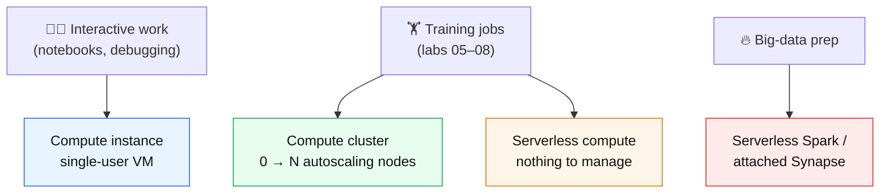

# Lab 03 — Compute Targets

**Exam mapping:** *Design and implement an MLOps infrastructure* → "Create and manage compute targets"

**Time:** ~45 minutes | **Cost:** a compute instance bills while running — this lab sets an auto-shutdown schedule; the cluster scales to zero.

**Prerequisites:** Labs 01–02.

---

## 1. Concepts

### 1.1 The four kinds of compute

| Type | What it is | Typical use | Billing behavior |
|---|---|---|---|
| **Compute instance** | A single managed VM assigned to *one user* | Notebooks, debugging, small experiments | Bills whenever running — stop it! |
| **Compute cluster** | Auto-scaling pool of identical VMs | Training jobs, sweeps, pipelines, batch scoring | Scales `min` ↔ `max` nodes; with `min=0`, costs nothing idle |
| **Serverless compute** | On-demand compute Azure ML provisions per job — nothing to create | Training jobs without infra management | Per-job; nothing exists between jobs |
| **Attached compute** | External resource you bring (Synapse Spark, existing VMs) | Spark-scale data prep, special cases | Billed by the external service |

Inference has its own compute story (managed online endpoints, batch on clusters/serverless) — that's Labs 10–11.



### 1.2 Sizing decisions the exam cares about

- **`min_instances: 0`** on clusters means no idle cost but a **cold-start delay** (~a few minutes to provision a node) on the first job. `min_instances: 1` removes the delay, at constant cost.
- **`max_instances`** bounds parallelism — a sweep or pipeline can run at most that many trials/steps concurrently.
- **Low-priority VMs** (`tier: low_priority`) cost a fraction of dedicated but can be **preempted** — fine for fault-tolerant/restartable training, wrong for time-critical runs.
- **GPU SKUs** (`Standard_NC…`) need regional quota; distributed deep learning uses multi-node GPU clusters (Lab 05 §distributed).
- A compute instance is **single-user** by design (the assigned user); it cannot be shared.

### 1.3 Identity on compute

A cluster or instance can carry a **managed identity**. Jobs running on it can then authenticate to storage/Key Vault/ACR *as the compute* — no credentials in code. This pairs with the identity-based datastore from Lab 02.

---

## 2. Steps

### Step 1 — Create a compute instance (for notebook work)

```powershell
$userName = $env:USERNAME.ToLower() -replace '[^a-z0-9-]', '-'
$computeName = "ci-$userName-dev"

az ml compute create `
  --name $computeName `
  --type ComputeInstance `
  --size Standard_DS11_v2
```

> Compute instance names must be unique per Azure region, hence the username suffix.

Set an **auto-shutdown schedule** so a forgotten instance doesn't bill overnight — in Studio: **Compute → your instance → Details** pane → **Edit** next to *Schedules* → add a daily stop at e.g. 19:00. (Schedules can also be set at creation time via YAML/ARM.)

### Step 2 — Create a compute cluster (for jobs)

Create `infra/compute-cluster.yml`:

```yaml
$schema: https://azuremlschemas.azureedge.net/latest/amlCompute.schema.json
name: cpu-cluster
type: amlcompute
size: Standard_DS11_v2
min_instances: 0          # scale to zero when idle → no idle cost
max_instances: 2          # caps parallelism AND cost
idle_time_before_scale_down: 120   # seconds a node stays warm after a job
tier: dedicated           # try low_priority to see the cost difference
```

```powershell
az ml compute create --file infra/compute-cluster.yml
az ml compute show --name cpu-cluster --query '{state:provisioning_state, min:scale_settings.min_instances, max:scale_settings.max_instances}'
```

### Step 3 — Same thing via the SDK (know both forms)

```python
# create_compute.py — SDK equivalent (idempotent; running it again is a no-op)
from azure.ai.ml import MLClient
from azure.ai.ml.entities import AmlCompute
from azure.identity import DefaultAzureCredential

ml_client = MLClient.from_config(credential=DefaultAzureCredential())

cluster = AmlCompute(
    name="cpu-cluster",
    size="Standard_DS11_v2",
    min_instances=0,
    max_instances=2,
    idle_time_before_scale_down=120,
    tier="dedicated",
)
ml_client.begin_create_or_update(cluster).result()
print("cluster ready")
```

### Step 4 — Understand serverless compute (nothing to create)

Serverless compute is used by *not specifying* a compute target on a job. Preview it now — you'll actually use it in Lab 05:

```yaml
# a job that names a compute target:
compute: azureml:cpu-cluster
# the same job on serverless: just omit `compute`, optionally size it:
resources:
  instance_type: Standard_DS11_v2
  instance_count: 1
```

> **Exam point:** serverless compute removes cluster management but gives up control of `min_instances` warm pools, custom identities per cluster, and node reuse between pipeline steps.

### Step 5 — Try a quota check (common real-world failure)

```powershell
az ml compute list-usage -o table
```

This lists your regional vCPU quota per VM family. If a later lab fails with `QuotaExceeded`, this is where you look; request increases via the portal (*Quotas* page in Studio).

### Step 6 — Stop the compute instance

```powershell
az ml compute stop --name $computeName
```

A stopped instance keeps its disk (notebooks survive) but stops compute billing. Start it again anytime with `az ml compute start`.

---

## 3. Verify

- [ ] `az ml compute list -o table` shows the instance (Stopped) and `cpu-cluster` (Succeeded, 0 nodes)
- [ ] The instance has an auto-shutdown schedule
- [ ] You can explain when to choose serverless vs. a cluster with `min_instances: 1`

## 4. Key takeaways

1. **Instance** = your personal dev VM. **Cluster** = elastic job pool. **Serverless** = per-job compute with zero management.
2. `min_instances: 0` trades cold-start latency for zero idle cost; `low_priority` trades preemption risk for ~80% savings.
3. Compute carries **managed identities** so jobs access data without secrets.

## 5. Docs

- [Compute targets concept](https://learn.microsoft.com/azure/machine-learning/concept-compute-target)
- [Create compute clusters](https://learn.microsoft.com/azure/machine-learning/how-to-create-attach-compute-cluster)
- [Compute instances](https://learn.microsoft.com/azure/machine-learning/concept-compute-instance)
- [Serverless compute for jobs](https://learn.microsoft.com/azure/machine-learning/how-to-use-serverless-compute)

**Next:** [Lab 04 — Environments & Components](lab-04-environments-and-components.md)
