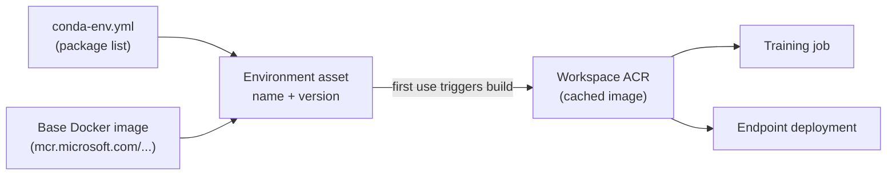
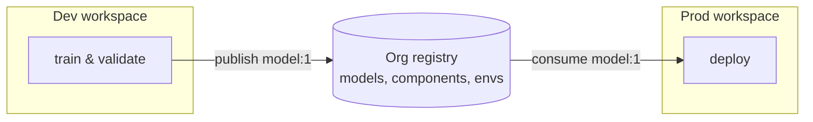

# Lab 04 — Environments, Components & Registries

**Exam mapping:** *Design and implement an MLOps infrastructure* → "Create and manage environments", "Create and manage components", "Share assets across workspaces by using registries"

**Time:** ~50 minutes | **Cost:** one small image build in ACR (pennies)

**Prerequisites:** Labs 01–03.

---

## 1. Concepts

### 1.1 Environments: reproducible runtime

An **environment** captures everything a job or deployment needs to run: base Docker image + Python packages (+ env variables). Azure ML builds it into a Docker image (cached in your workspace ACR) so the *same* image runs your training job today, your retraining pipeline next month, and your endpoint in production.

Three flavors:

| Flavor | Definition | When |
|---|---|---|
| **Curated** | Prebuilt & maintained by Microsoft, prefixed `AzureML-` / served from the `azureml` registry | Start here — fast (no build), tested |
| **Custom: conda on base image** | You give a base Docker image + a conda YAML | Most common custom path |
| **Custom: own Docker image/context** | You bring a full image or Dockerfile | Exotic system dependencies |



> **Exam point:** environments are **versioned assets**. A job spec pins `environment: azureml:my-env:3` — bumping packages means a *new version*, never mutating an old one. Curated environments are referenced like `azureml://registries/azureml/environments/sklearn-1.5/labels/latest`.

### 1.2 Components: reusable pipeline steps

A **component** is a self-contained, versioned unit of computation: typed *inputs* → *code + command + environment* → typed *outputs*. Think "function signature for a pipeline step". Registering components lets teams share tested steps (data prep, training, evaluation) and lets pipelines **reuse cached outputs** when inputs haven't changed.

This repo already contains two component specs — read them now:

- `src/components/prep.yml` → wraps `prep.py` (uri_file in → uri_folder out)
- `src/components/train.yml` → wraps `train.py` (uri_folder + number in → mlflow_model out)

### 1.3 Registries: sharing across workspaces

A workspace's assets are visible only inside it. An **Azure ML registry** is an org-level catalog where you publish environments, components, models, and data assets once and consume them from *any* workspace (even cross-region — registries replicate to the regions you pick). This is the backbone of the dev → test → prod promotion pattern:



---

## 2. Steps

### Step 1 — Browse curated environments

```powershell
az ml environment list --registry-name azureml --query "[?contains(name,'sklearn')].name" -o tsv
```

Studio also lists them: **Environments → Curated environments**. Note the naming and that each has OS/CUDA/package details.

### Step 2 — Create a custom environment

`src/conda-env.yml` in this repo pins sklearn, pandas, mlflow, and `azureml-mlflow`. Create `infra/environment.yml`:

```yaml
$schema: https://azuremlschemas.azureedge.net/latest/environment.schema.json
name: diabetes-train-env
version: "1"
description: Training environment for the diabetes labs (sklearn + mlflow).
image: mcr.microsoft.com/azureml/openmpi4.1.0-ubuntu22.04:latest
conda_file: ../src/conda-env.yml
```

```powershell
az ml environment create --file infra/environment.yml
```

> The image doesn't build yet — builds are **lazy**, triggered by first use. You can force/inspect a build in Studio: **Environments → diabetes-train-env → Build log** after Lab 05's first job.

SDK equivalent (for recognition):

```python
from azure.ai.ml.entities import Environment
env = Environment(
    name="diabetes-train-env", version="1",
    image="mcr.microsoft.com/azureml/openmpi4.1.0-ubuntu22.04:latest",
    conda_file="src/conda-env.yml",
)
ml_client.environments.create_or_update(env)
```

### Step 3 — Register the components

```powershell
az ml component create --file src/components/prep.yml
az ml component create --file src/components/train.yml
az ml component list -o table
```

Open `src/components/train.yml` and connect each block to the concept:

- `inputs:` / `outputs:` — the typed signature (`uri_folder`, `number`, `mlflow_model`)
- `code: ..` — the snapshot folder uploaded with the component (here `src/`, so `train.py` is included)
- `command:` — how inputs/outputs are spliced in via `${{inputs.reg_rate}}` template syntax
- `environment:` — pinned runtime (a curated sklearn env from the `azureml` registry)

In Studio: **Components** → open `train_diabetes_model` → see the auto-generated documentation card. Lab 08 wires these into a pipeline.

### Step 4 — (Optional, needs permissions) Create a registry and share an asset

Creating a registry requires subscription-level permissions; skip if you lack them and just study the flow.

```powershell
# registry.yml
@'
name: letsaml-registry
location: <your-region>
replication_locations:
  - location: <your-region>
'@ | Set-Content -Path infra/registry.yml

az ml registry create --file infra/registry.yml

# Publish the component to the registry instead of the workspace:
az ml component create --file src/components/train.yml --registry-name letsaml-registry

# Any workspace can now reference it as:
#   azureml://registries/letsaml-registry/components/train_diabetes_model/versions/1
```

> **Exam point:** you can also *promote* existing workspace assets to a registry (share), and consume registry assets in jobs/pipelines by the `azureml://registries/...` URI. Models promoted to a registry can be deployed into any workspace — that's the cross-workspace MLOps pattern.

---

## 3. Verify

- [ ] `az ml environment show --name diabetes-train-env --version 1` succeeds
- [ ] `az ml component list -o table` shows `prep_diabetes_data` and `train_diabetes_model`
- [ ] You can explain why an environment version, not `latest`, belongs in a production job spec

## 4. Key takeaways

1. Environments make runtime reproducible; they're versioned, lazily built into ACR images, and shared by training *and* inference.
2. Components give pipeline steps a typed, versioned, reusable contract — enabling caching and team sharing.
3. Registries are the promotion vehicle: publish once (envs/components/models/data), consume from any workspace.

## 5. Docs

- [Environments concept](https://learn.microsoft.com/azure/machine-learning/concept-environments)
- [Manage environments (CLI/SDK)](https://learn.microsoft.com/azure/machine-learning/how-to-manage-environments-v2)
- [Component concept](https://learn.microsoft.com/azure/machine-learning/concept-component)
- [Share assets with registries](https://learn.microsoft.com/azure/machine-learning/how-to-share-models-pipelines-across-workspaces-with-registries)

**Next:** [Lab 05 — Training Jobs & MLflow Tracking](lab-05-training-jobs-and-mlflow.md)
