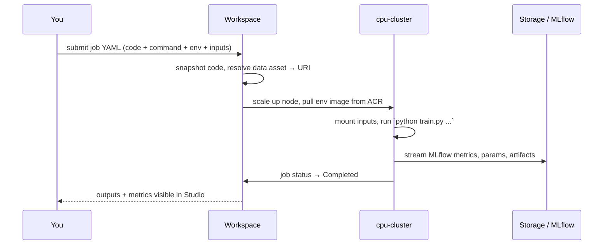

# Lab 05 — Training Jobs & MLflow Tracking

**Exam mapping:** *Implement ML model lifecycle and operations* → "Run model training scripts", "Configure experiment tracking with MLflow", "Use notebooks for experimentation and exploration", "Manage distributed training", "Compare model performance across jobs"

**Time:** ~60 minutes | **Cost:** a few minutes of cluster time (scales back to zero)

**Prerequisites:** Labs 01–04 (data assets, `cpu-cluster`, `diabetes-train-env` all exist).

---

## 1. Concepts

### 1.1 The command job

The fundamental unit of training in Azure ML is the **command job**: *run this command, from this code snapshot, in this environment, on this compute, with these inputs/outputs*. Everything else (sweeps, pipelines, AutoML) composes or generates command jobs.



Key mechanics to internalize:

- **Code snapshot:** the `code:` folder is uploaded with the job — the run is reproducible even if you edit files later.
- **Inputs:** data assets are resolved and **mounted** (`ro_mount`, default) or **downloaded** to the node; your script just receives a path.
- **Template syntax:** `${{inputs.training_data}}` in the command is replaced with that path at runtime.

### 1.2 MLflow is *the* tracking story

Azure ML adopted **MLflow** as its native tracking API — the exam expects it, not the legacy `Run.log()`. Inside any Azure ML job, the MLflow **tracking URI is pre-configured**; anything you log lands in the workspace automatically:

| MLflow call | What it records |
|---|---|
| `mlflow.autolog()` | Params, metrics, and artifacts automatically for supported frameworks (sklearn, XGBoost, PyTorch Lightning…) |
| `mlflow.log_metric("auc", 0.91)` | A named metric (can be a series over steps) |
| `mlflow.log_param(...)` / `log_artifact(...)` | Hyperparameters / files (plots, reports) |
| `mlflow.sklearn.log_model(...)` | The model in **MLflow format** — self-describing (signature + env), deployable without a scoring script (Lab 10) |

An **experiment** groups related runs (jobs); each job = one MLflow **run**. From *outside* a job (your laptop, a notebook), point MLflow at the workspace with `mlflow.set_tracking_uri(ws.mlflow_tracking_uri)` and everything works the same — that's also how you *query* runs to compare them.

### 1.3 Notebooks' place in the workflow

Notebooks (on your compute instance, in Studio, or VS Code attached to the instance) are for **exploration**: probe the data, prototype the model, iterate fast. The exam pattern: *explore in notebooks → move stable code into scripts → submit as jobs*. Jobs give you the snapshot, environment pinning, and tracking that notebooks alone don't.

### 1.4 Distributed training (know the vocabulary)

For models too large/slow for one node:

- **Data parallelism** — each node holds a full model copy, processes different data shards, gradients are synchronized (PyTorch DDP, Horovod).
- **Model parallelism** — the model itself is split across devices (DeepSpeed, for models that don't fit in one GPU's memory).

In a job spec this is the `distribution` + `resources` block:

```yaml
distribution:
  type: pytorch                  # or mpi | tensorflow
  process_count_per_instance: 1  # processes per node (usually = GPUs per node)
resources:
  instance_count: 2              # number of nodes
```

Azure ML sets up the inter-node communication (MASTER_ADDR, ranks, etc.). You won't run this on your CPU quota — recognize the YAML and the two parallelism types.

---

## 2. Steps

### Step 1 — Read the training script

Open `src/train.py`. Note the three things that make it "cloud-ready":

1. `argparse` — all inputs arrive as CLI arguments (paths and hyperparameters), so the job YAML controls them.
2. `mlflow.autolog()` + explicit `log_metric` — tracking with zero Azure-specific code.
3. `mlflow.sklearn.log_model / save_model` — model saved in MLflow format with an input example (which gives it a **signature**).

Run it locally first (fast feedback loop — always do this before submitting):

```bash
source .venv/bin/activate
python src/train.py --training-data data/diabetes.csv --reg-rate 0.01
```

### Step 2 — Define the job (YAML)

Create `jobs/train-job.yml`:

```yaml
$schema: https://azuremlschemas.azureedge.net/latest/commandJob.schema.json
type: command
display_name: diabetes-train-baseline
experiment_name: diabetes-training

code: ../src                       # snapshot: uploaded with the job
command: >-
  python train.py
  --training-data ${{inputs.training_data}}
  --reg-rate ${{inputs.reg_rate}}
inputs:
  training_data:
    type: uri_file
    path: azureml:diabetes-csv:1   # the data asset from Lab 02
    mode: ro_mount
  reg_rate: 0.01
environment: azureml:diabetes-train-env:1
compute: azureml:cpu-cluster
```

### Step 3 — Submit and watch

```bash
az ml job create --file jobs/train-job.yml --web
```

`--web` opens the run in Studio. While it runs, explore the tabs:

- **Overview** — status, compute, snapshot link
- **Metrics** — `test_accuracy`, `test_auc`, plus autologged training metrics
- **Outputs + logs** — `user_logs/std_log.txt` is your script's stdout; `system_logs/` shows image build & node prep (first run takes longer: it's building `diabetes-train-env`)

Stream logs from the terminal instead, if you prefer:

```bash
az ml job stream --name <job-name>
```

### Step 4 — Submit a second run with different hyperparameters

```bash
az ml job create --file jobs/train-job.yml --set inputs.reg_rate=1.0
```

> `--set` overrides YAML values at submit time — the idiom for "same job, different knob".

### Step 5 — Compare runs

**Studio:** Jobs → experiment `diabetes-training` → tick both runs → **Compare** — params and metrics side by side.

**Programmatically (the MLflow client):** create `compare_runs.py`:

```python
import mlflow
from azure.ai.ml import MLClient
from azure.identity import DefaultAzureCredential

ml_client = MLClient.from_config(credential=DefaultAzureCredential())
mlflow.set_tracking_uri(
    ml_client.workspaces.get(ml_client.workspace_name).mlflow_tracking_uri
)

runs = mlflow.search_runs(
    experiment_names=["diabetes-training"],
    order_by=["metrics.test_auc DESC"],
)
print(runs[["run_id", "params.reg_rate", "metrics.test_auc", "metrics.test_accuracy"]])
best = runs.iloc[0]
print(f"\nBest run: {best.run_id} (AUC {best['metrics.test_auc']:.4f})")
```

```bash
python compare_runs.py
```

> **Exam point:** `mlflow.search_runs` with `order_by` on a metric is *the* pattern for "find the best model across jobs" — it also feeds automated model selection in CI/CD.

### Step 6 — SDK submission (recognize the shape)

```python
# submit_job.py — SDK equivalent of the YAML
from azure.ai.ml import MLClient, command, Input
from azure.identity import DefaultAzureCredential

ml_client = MLClient.from_config(credential=DefaultAzureCredential())

job = command(
    code="src",
    command="python train.py --training-data ${{inputs.training_data}} --reg-rate ${{inputs.reg_rate}}",
    inputs={
        "training_data": Input(type="uri_file", path="azureml:diabetes-csv:1"),
        "reg_rate": 0.5,
    },
    environment="azureml:diabetes-train-env:1",
    compute="cpu-cluster",
    experiment_name="diabetes-training",
    display_name="diabetes-train-sdk",
)
returned = ml_client.jobs.create_or_update(job)
print(returned.studio_url)
```

### Step 7 — Try serverless (delete nothing, manage nothing)

```bash
az ml job create --file jobs/train-job.yml \
  --set compute=null \
  --set resources.instance_type=Standard_DS11_v2 \
  --set display_name=diabetes-train-serverless
```

Same job, no cluster involved — Azure ML provisions ephemeral compute. Compare queue time vs. the (now warm) cluster.

---

## 3. Verify

- [ ] At least 3 completed runs in experiment `diabetes-training`
- [ ] `compare_runs.py` ranks them by AUC
- [ ] You can explain what `${{inputs.x}}`, `mode: ro_mount`, and `mlflow.autolog()` each do

## 4. Key takeaways

1. Command job = code snapshot + command + environment + compute + typed inputs/outputs. Everything else builds on it.
2. MLflow is the tracking and model-format standard in Azure ML — autolog for convenience, `log_model` for deployable models, `search_runs` for comparison.
3. Notebooks explore; **jobs** make it reproducible. Distributed training = `distribution` + `resources.instance_count` (data vs. model parallelism).

## 5. Docs

- [Train models with the CLI/SDK v2](https://learn.microsoft.com/azure/machine-learning/how-to-train-model)
- [MLflow tracking in Azure ML](https://learn.microsoft.com/azure/machine-learning/how-to-use-mlflow-cli-runs)
- [Command job YAML schema](https://learn.microsoft.com/azure/machine-learning/reference-yaml-job-command)
- [Distributed training guidance](https://learn.microsoft.com/azure/machine-learning/concept-distributed-training)

**Next:** [Lab 06 — AutoML](lab-06-automl.md)
