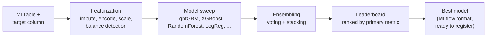

# Lab 06 — Automated Machine Learning (AutoML)

**Exam mapping:** *Implement ML model lifecycle and operations* → "Use automated machine learning to explore optimal models"

**Time:** ~60 minutes (much of it waiting on the AutoML job) | **Cost:** ~30–40 min of cluster time

**Prerequisites:** Labs 01–05. The `diabetes-table` **MLTable** asset from Lab 02 is required — AutoML only accepts `mltable` inputs for tabular tasks.

---

## 1. Concepts

### 1.1 What AutoML automates

Given a task type, a dataset, and a target metric, AutoML runs a search over **featurization × algorithm × hyperparameters** and returns a ranked leaderboard of models:



Supported task types: **classification, regression, forecasting** (tabular); plus image (classification/detection/segmentation) and NLP tasks. The tabular three are the exam's focus.

### 1.2 The knobs that matter

| Setting | Controls | Exam angle |
|---|---|---|
| `primary_metric` | What "best" means (e.g., `AUC_weighted`, `accuracy`, `normalized_root_mean_squared_error`) | Pick metrics robust to imbalance (AUC over accuracy) |
| `limits.timeout_minutes` / `trial_timeout_minutes` | Total / per-trial wall clock | Cost control |
| `limits.max_trials` / `max_concurrent_trials` | Search breadth / parallelism (≤ cluster `max_instances`) | Concurrency is bounded by cluster size |
| `limits.enable_early_termination` | Kill unpromising trials | Saves cost |
| `training.allowed_training_algorithms` / `blocked_training_algorithms` | Constrain the search space | e.g., block XGBoost for interpretability policies |
| `training.enable_model_explainability` | Explanations for the best model | Responsible AI tie-in (Lab 09) |
| `featurization.mode` | `auto` / `custom` / `off` | `auto` handles imputation, encoding, scaling |
| `n_cross_validations` / validation data | How generalization is estimated | Small data → cross-validation |

### 1.3 Guardrails

AutoML runs **data guardrails** before training: class-imbalance detection, missing-value handling, high-cardinality feature detection. Results appear in the job UI — the exam expects you to know these exist and where to find them.

---

## 2. Steps

### Step 1 — Define the AutoML job (YAML)

Create `jobs/automl-job.yml`:

```yaml
$schema: https://azuremlschemas.azureedge.net/latest/autoMLJob.schema.json
type: automl
task: classification
display_name: diabetes-automl
experiment_name: diabetes-automl

target_column_name: Diabetic
primary_metric: AUC_weighted

training_data:
  type: mltable
  path: azureml:diabetes-table:1

compute: azureml:cpu-cluster
n_cross_validations: 5

limits:
  timeout_minutes: 40
  trial_timeout_minutes: 10
  max_trials: 12
  max_concurrent_trials: 2        # matches cpu-cluster max_instances
  enable_early_termination: true

training:
  enable_model_explainability: true

featurization:
  mode: auto
```

### Step 2 — Submit

```bash
az ml job create --file jobs/automl-job.yml --web
```

### Step 3 — While it runs: SDK equivalent

The SDK uses task-specific factory functions — recognize this shape:

```python
from azure.ai.ml import automl, Input, MLClient
from azure.identity import DefaultAzureCredential

ml_client = MLClient.from_config(credential=DefaultAzureCredential())

job = automl.classification(
    experiment_name="diabetes-automl",
    training_data=Input(type="mltable", path="azureml:diabetes-table:1"),
    target_column_name="Diabetic",
    primary_metric="AUC_weighted",
    n_cross_validations=5,
    enable_model_explainability=True,
    compute="cpu-cluster",
)
job.set_limits(timeout_minutes=40, trial_timeout_minutes=10,
               max_trials=12, max_concurrent_trials=2,
               enable_early_termination=True)
# ml_client.jobs.create_or_update(job)   # (don't double-submit)
```

### Step 4 — Read the results like an examiner

When the parent job completes, in Studio open it and inspect:

1. **Data guardrails tab** — what did it flag? (With our synthetic data: likely "class balancing detection: passed".)
2. **Models + child jobs tab** — the leaderboard. Note which algorithms won (usually gradient-boosted ensembles) and the final **VotingEnsemble/StackEnsemble** entries near the top.
3. Click the best model → **Metrics** — full metric suite (AUC, F1, precision/recall curves, calibration).
4. Best model → **Explanations** — feature importance from `enable_model_explainability` (expect `PlasmaGlucose` and `BMI` on top — that's how the data was generated).

### Step 5 — Retrieve the best model programmatically

Each trial is a child job; the best model is an MLflow model in the best child's outputs:

```python
# best_automl.py
import mlflow
from azure.ai.ml import MLClient
from azure.identity import DefaultAzureCredential

ml_client = MLClient.from_config(credential=DefaultAzureCredential())
mlflow.set_tracking_uri(ml_client.workspaces.get(ml_client.workspace_name).mlflow_tracking_uri)

parent = "<automl-parent-job-name>"   # e.g. from `az ml job list -o table`
best = mlflow.search_runs(
    experiment_names=["diabetes-automl"],
    filter_string=f"tags.mlflow.parentRunId = '{parent}'",
    order_by=["metrics.AUC_weighted DESC"],
).iloc[0]
print("best child run:", best.run_id, "AUC:", best["metrics.AUC_weighted"])
# Register it directly from the run (Lab 09 covers registration properly):
# mlflow.register_model(f"runs:/{best.run_id}/outputs/mlflow-model", "diabetes-automl-model")
```

### Step 6 — When to use AutoML vs. your own training (judgment)

| Prefer AutoML | Prefer custom training (Labs 05/07) |
|---|---|
| Establishing a **baseline** fast | You need a specific architecture/loss |
| Tabular problems, standard metrics | Custom featurization/domain logic |
| Team without deep ML expertise | Tight control over training loop |

AutoML's baseline also tells you whether your hand-built model (Lab 05, AUC ≈ 0.86–0.89) is even competitive.

---

## 3. Verify

- [ ] AutoML parent job Completed with ~12 trials on the leaderboard
- [ ] You found the data guardrails and the best model's explanations
- [ ] You can state why `mltable` is required and what `max_concurrent_trials` is bounded by

## 4. Key takeaways

1. AutoML = automated featurization + model sweep + ensembling, ranked by a **primary metric** you choose deliberately.
2. Cost control = `limits` (timeout, max trials, early termination); parallelism ≤ cluster nodes.
3. Guardrails and explainability make AutoML output auditable — feeding the Responsible AI story (Lab 09).

## 5. Docs

- [AutoML concept](https://learn.microsoft.com/azure/machine-learning/concept-automated-ml)
- [Set up AutoML for tabular data (CLI/SDK)](https://learn.microsoft.com/azure/machine-learning/how-to-configure-auto-train)
- [AutoML job YAML schema](https://learn.microsoft.com/azure/machine-learning/reference-yaml-job-automl)

**Next:** [Lab 07 — Hyperparameter Sweeps](lab-07-hyperparameter-sweeps.md)
