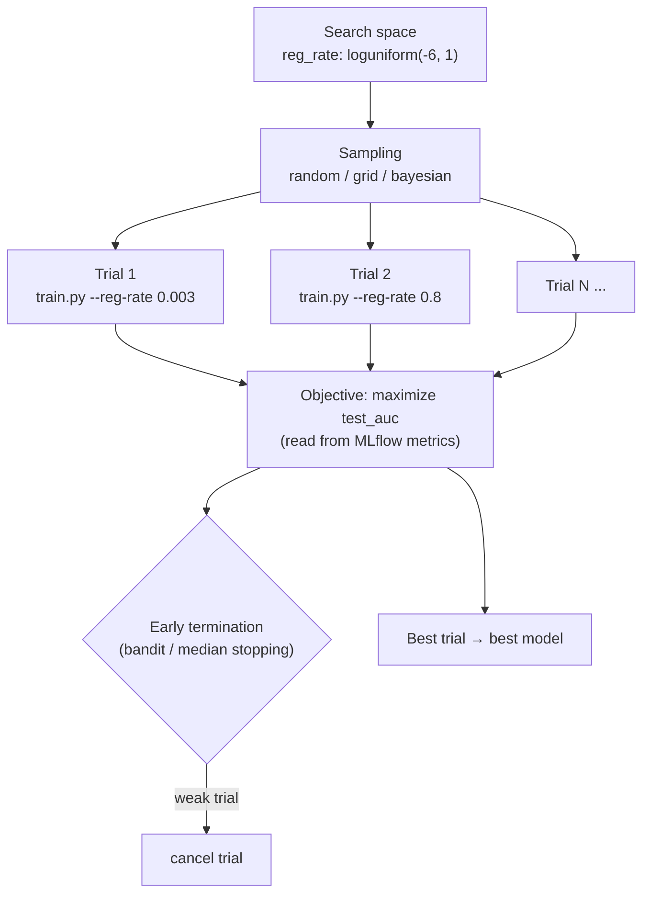

# Lab 07 — Hyperparameter Tuning with Sweep Jobs

**Exam mapping:** *Implement ML model lifecycle and operations* → "Automate hyperparameter tuning"

**Time:** ~40 minutes | **Cost:** ~10–15 min of cluster time

**Prerequisites:** Labs 01–05.

---

## 1. Concepts

### 1.1 Sweep = a command job × a search strategy

A **sweep job** wraps your existing training command in a search loop: it defines a **search space** over the script's arguments, a **sampling algorithm** to pick trial values, an **objective** metric to optimize, and optionally an **early-termination policy** to kill weak trials. Each trial is an ordinary command job logging metrics via MLflow — the sweep reads the logged objective to rank trials.



### 1.2 Search-space distributions

| Function | Meaning | Use for |
|---|---|---|
| `choice(a, b, c)` | Discrete set | Categorical params; required for **grid** sampling |
| `uniform(lo, hi)` | Continuous uniform | Scale-free ranges |
| `loguniform(lo, hi)` | log-scaled continuous — `exp(uniform(lo, hi))` | Learning/regularization rates spanning orders of magnitude |
| `quniform / qloguniform` | Quantized versions | Integer-ish ranges (batch size) |
| `normal / lognormal` | Gaussian around a known-good value | Fine refinement |

### 1.3 Sampling algorithms

- **Grid** — exhaustive over `choice` spaces only. Predictable, expensive.
- **Random** — samples independently; strong default, trivially parallel.
- **Bayesian** — each trial informed by previous results; best sample-efficiency, but limits parallelism (needs results to learn from) and doesn't support some early-termination policies.

### 1.4 Early-termination policies

Applied every `evaluation_interval` after `delay_evaluation` reporting intervals:

- **Bandit** — kill trials worse than (best × slack_factor / − slack_amount). Most aggressive.
- **Median stopping** — kill trials below the median of running averages. Conservative, no parameters to misjudge.
- **Truncation selection** — kill the bottom X% each interval.

> **Exam point:** our script logs the metric once at the end, so early termination can't help here (nothing to observe mid-run) — it shines for deep learning where the metric is reported every epoch. Know that trade-off.

---

## 2. Steps

### Step 1 — The script contract

A sweep needs the script to (a) expose each tunable as an **argument** and (b) **log the objective metric** via MLflow. `src/train.py` already does both (`--reg-rate`, `mlflow.log_metric("test_auc", ...)`). No changes needed — this is why Lab 05 structured it that way.

### Step 2 — Define the sweep (YAML)

Create `jobs/sweep-job.yml`:

```yaml
$schema: https://azuremlschemas.azureedge.net/latest/sweepJob.schema.json
type: sweep
display_name: diabetes-sweep
experiment_name: diabetes-sweep

trial:
  code: ../src
  command: >-
    python train.py
    --training-data ${{inputs.training_data}}
    --reg-rate ${{search_space.reg_rate}}
  environment: azureml:diabetes-train-env:1

inputs:
  training_data:
    type: uri_file
    path: azureml:diabetes-csv:1

compute: azureml:cpu-cluster

search_space:
  reg_rate:
    type: loguniform
    min_value: -6      # exp(-6) ≈ 0.0025
    max_value: 2       # exp(2)  ≈ 7.4

sampling_algorithm:
  type: random

objective:
  goal: maximize
  primary_metric: test_auc      # must EXACTLY match the mlflow.log_metric name

limits:
  max_total_trials: 12
  max_concurrent_trials: 2
  timeout: 3600

early_termination:
  type: bandit
  slack_factor: 0.1
  evaluation_interval: 1
  delay_evaluation: 3
```

> The two most common sweep bugs: `primary_metric` not matching the logged name exactly, and referencing `${{inputs.x}}` where you meant `${{search_space.x}}`.

### Step 3 — Submit and inspect

```bash
az ml job create --file jobs/sweep-job.yml --web
```

In Studio, the sweep parent job has a **Trials** tab with two charts worth studying:

- **Parallel coordinates** — each line is a trial: hyperparameter values → resulting metric. This is how you *see* which region of the space works.
- The trials table, sortable by `test_auc`.

### Step 4 — SDK equivalent (the `.sweep()` idiom)

```python
# submit_sweep.py
from azure.ai.ml import MLClient, command, Input
from azure.ai.ml.sweep import LogUniform, BanditPolicy
from azure.identity import DefaultAzureCredential

ml_client = MLClient.from_config(credential=DefaultAzureCredential())

base = command(
    code="src",
    command="python train.py --training-data ${{inputs.training_data}} --reg-rate ${{inputs.reg_rate}}",
    inputs={
        "training_data": Input(type="uri_file", path="azureml:diabetes-csv:1"),
        "reg_rate": 0.01,
    },
    environment="azureml:diabetes-train-env:1",
    compute="cpu-cluster",
)

# Overriding an input with a distribution + calling .sweep() turns it into a sweep job
sweep_job = base(
    training_data=Input(type="uri_file", path="azureml:diabetes-csv:1"),
    reg_rate=LogUniform(min_value=-6, max_value=2),
).sweep(
    sampling_algorithm="random",
    primary_metric="test_auc",
    goal="maximize",
    early_termination_policy=BanditPolicy(slack_factor=0.1, evaluation_interval=1, delay_evaluation=3),
)
sweep_job.set_limits(max_total_trials=12, max_concurrent_trials=2, timeout=3600)
sweep_job.experiment_name = "diabetes-sweep"
print(ml_client.jobs.create_or_update(sweep_job).studio_url)
```

### Step 5 — Get the best trial

```bash
# The parent job records the best child:
az ml job show --name <sweep-parent-name> \
  --query 'properties."best_child_run_id"'
```

Or via `mlflow.search_runs` filtered on the parent run id, exactly as in Lab 06 Step 5. Note the winning `reg_rate` — you'll register this model in Lab 09.

---

## 3. Verify

- [ ] Sweep completed with 12 trials; parallel-coordinates chart shows the metric surface
- [ ] You retrieved the best child run and its `reg_rate`
- [ ] You can match each sampling algorithm and termination policy to a scenario

## 4. Key takeaways

1. Sweep = trial command + search space + sampling + objective (+ early termination). The script contract: args in, MLflow metric out.
2. `loguniform` for rates; `choice` + grid only for small discrete spaces; bayesian for sample-efficiency, random for parallelism.
3. Early termination saves money only when the metric is reported **during** training.

## 5. Docs

- [Hyperparameter tuning concept & how-to](https://learn.microsoft.com/azure/machine-learning/how-to-tune-hyperparameters)
- [Sweep job YAML schema](https://learn.microsoft.com/azure/machine-learning/reference-yaml-job-sweep)

**Next:** [Lab 08 — Pipelines](lab-08-pipelines.md)
