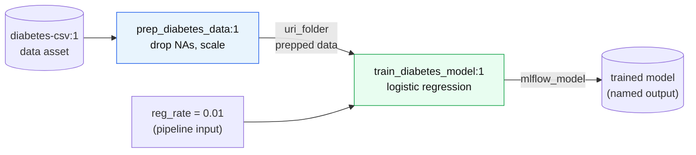

# Lab 08 — Training Pipelines

**Exam mapping:** *Implement ML model lifecycle and operations* → "Implement training pipelines"; reuses "Create and manage components" from Lab 04

**Time:** ~50 minutes | **Cost:** a few minutes of cluster time

**Prerequisites:** Labs 01–05; components registered in Lab 04.

---

## 1. Concepts

### 1.1 Why pipelines

A **pipeline job** is a DAG of steps where outputs feed inputs. Compared to one monolithic script it buys you:

- **Caching/reuse** — a step whose code, inputs, and parameters are unchanged is *skipped* and its cached output reused (`is_deterministic`). Change only the training step → data prep doesn't rerun.
- **Heterogeneous compute** — CPU for prep, GPU for training, each step chooses.
- **Modularity** — steps are the registered components from Lab 04, versioned and shared.
- **Operationalization** — a pipeline is the unit you *schedule* (retraining) and *trigger from CI/CD* (Lab 13).



### 1.2 How data flows between steps

Step outputs are written to workspace storage; downstream steps mount them. The binding syntax is the exam's favorite:

- `${{parent.inputs.raw_data}}` — a pipeline-level input, passed into a step
- `${{parent.jobs.prep.outputs.output_data}}` — wire step `prep`'s output into another step's input
- `${{parent.outputs.model}}` — expose a step output as a pipeline-level (named) output

### 1.3 Schedules

Pipelines are operationalized with **schedules** — cron or recurrence triggers owned by the workspace. A schedule + a retraining pipeline + a drift signal (Lab 12) is the classic automated-retraining answer.

---

## 2. Steps

### Step 1 — Define the pipeline (YAML, referencing registered components)

Create `jobs/pipeline-job.yml`:

```yaml
$schema: https://azuremlschemas.azureedge.net/latest/pipelineJob.schema.json
type: pipeline
display_name: diabetes-train-pipeline
experiment_name: diabetes-pipeline

settings:
  default_compute: azureml:cpu-cluster

inputs:
  raw_data:
    type: uri_file
    path: azureml:diabetes-csv:1
  reg_rate: 0.01

outputs:
  trained_model:
    type: mlflow_model

jobs:
  prep:
    type: command
    component: azureml:prep_diabetes_data:1
    inputs:
      input_data: ${{parent.inputs.raw_data}}
    outputs:
      output_data:

  train:
    type: command
    component: azureml:train_diabetes_model:1
    inputs:
      training_data: ${{parent.jobs.prep.outputs.output_data}}
      reg_rate: ${{parent.inputs.reg_rate}}
    outputs:
      model_output: ${{parent.outputs.trained_model}}
```

Read it against §1.2 — every binding form appears once.

### Step 2 — Submit and study the DAG

```powershell
az ml job create --file jobs/pipeline-job.yml --web
```

Studio renders the pipeline as a graph. Click each node → its own logs/metrics (each step is a child command job). Note the `train` step's metrics came from the same `train.py` MLflow logging as always.

### Step 3 — Witness caching

Resubmit with **only** the hyperparameter changed:

```powershell
az ml job create --file jobs/pipeline-job.yml --set inputs.reg_rate=1.0
```

In the new run's graph, the `prep` node completes in seconds with a **"reused"** badge — identical component version + inputs ⇒ cached output. Only `train` actually ran. This is `is_deterministic: true` (the component default) at work.

> To force a rerun of everything: `settings.force_rerun: true` in the pipeline YAML.

### Step 4 — The SDK's `@dsl.pipeline` decorator (recognize it)

```python
# pipeline_sdk.py
from azure.ai.ml import MLClient, Input, dsl
from azure.identity import DefaultAzureCredential

ml_client = MLClient.from_config(credential=DefaultAzureCredential())
prep = ml_client.components.get("prep_diabetes_data", version="1")
train = ml_client.components.get("train_diabetes_model", version="1")

@dsl.pipeline(default_compute="cpu-cluster", experiment_name="diabetes-pipeline")
def diabetes_pipeline(raw_data: Input, reg_rate: float = 0.01):
    prep_step = prep(input_data=raw_data)
    train_step = train(training_data=prep_step.outputs.output_data, reg_rate=reg_rate)
    return {"trained_model": train_step.outputs.model_output}

pipeline_job = diabetes_pipeline(
    raw_data=Input(type="uri_file", path="azureml:diabetes-csv:1"),
    reg_rate=0.5,
)
print(ml_client.jobs.create_or_update(pipeline_job).studio_url)
```

The decorator turns a plain function into a DAG builder: calling a component returns a step object whose `.outputs.<name>` you wire onward; the function's return dict defines pipeline outputs.

### Step 5 — Schedule it (retraining cadence)

Create `jobs/schedule.yml`:

```yaml
$schema: https://azuremlschemas.azureedge.net/latest/schedule.schema.json
name: diabetes-weekly-retrain
display_name: Weekly diabetes retraining
trigger:
  type: cron
  expression: "0 6 * * 1"        # Mondays 06:00
  time_zone: "W. Europe Standard Time"
create_job: ./pipeline-job.yml
```

```powershell
az ml schedule create --file jobs/schedule.yml
az ml schedule list -o table

# You don't want this actually firing weekly during the labs:
az ml schedule disable --name diabetes-weekly-retrain
```

> **Exam point:** schedules answer "retrain every Monday". Event-*driven* retraining ("retrain when drift is detected") = monitoring signal + trigger, covered in Lab 12.

---

## 3. Verify

- [ ] Pipeline ran end-to-end; second submission showed `prep` as **reused**
- [ ] Named output `trained_model` visible on the pipeline job's Outputs
- [ ] Schedule exists and is disabled

## 4. Key takeaways

1. Pipelines = DAGs of versioned components; bindings use `${{parent.inputs/jobs/outputs...}}`.
2. Deterministic components give **free caching** — the economic reason to decompose training.
3. Pipelines are the schedulable, CI/CD-triggerable unit of MLOps.

## 5. Docs

- [Pipeline concept](https://learn.microsoft.com/azure/machine-learning/concept-ml-pipelines)
- [Create pipelines with components (CLI)](https://learn.microsoft.com/azure/machine-learning/how-to-create-component-pipelines-cli)
- [Schedule pipeline jobs](https://learn.microsoft.com/azure/machine-learning/how-to-schedule-pipeline-job)

**Next:** [Lab 09 — Model Registration & Responsible AI](lab-09-model-registration-and-responsible-ai.md)
