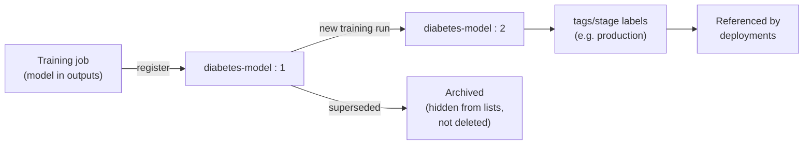

# Lab 09 — Model Registration, Versioning & Responsible AI

**Exam mapping:** *Implement ML model lifecycle and operations* → "Register an MLflow model", "Package a feature retrieval specification with the model artifact", "Evaluate a model by using responsible AI principles", "Manage model lifecycle, including archiving models"

**Time:** ~60 minutes | **Cost:** one short pipeline run for the RAI dashboard

**Prerequisites:** Labs 01–08 (you have completed training jobs to register models from).

---

## 1. Concepts

### 1.1 The model registry

The workspace **model registry** is the handoff point between training and deployment. A registered model is a **named, versioned, immutable artifact** with lineage back to the job that produced it. Deployments (Labs 10–11) reference `model: azureml:name:version` — never a file path.

Three model types:

| Type | Contents | Deployment consequence |
|---|---|---|
| `mlflow_model` | MLflow format: model + signature + conda env (`MLmodel` file) | **No scoring script or environment needed** — Azure ML generates them |
| `custom_model` | Arbitrary files (pickle, weights) | You must supply a scoring script + environment |
| `triton_model` | Triton server layout | High-performance inference on Triton |

> **Exam point:** "deploy with least effort / no scoring script" → register as **MLflow model**. The signature (input/output schema, captured from `input_example` in Lab 05's `log_model`) is what enables request validation and no-code deployment.

### 1.2 Model lifecycle



- Versions auto-increment per name; tags/properties carry metadata (metrics, approval state).
- **Archiving** hides an asset (or a whole asset container) from listings without breaking lineage; it is the supported "retirement" mechanism. You can restore archived assets.
- With a **registry** (Lab 04 §registries), models are *shared/promoted* across workspaces.

### 1.3 Feature retrieval specification

When features come from a **managed feature store** (a separate workspace kind that centralizes feature engineering), training jobs record *which* features they used in a `feature_retrieval_spec.yaml`. **Packaging that spec with the model artifact** lets inference look up the same features consistently — preventing training/serving skew. For the exam: know that the spec is generated by the feature-retrieval step, stored alongside the model artifact, and enables the same retrieval at scoring time.

### 1.4 Responsible AI (RAI)

Microsoft's RAI principles: **fairness, reliability & safety, privacy & security, inclusiveness, transparency, accountability**. In Azure ML they materialize as the **Responsible AI dashboard** — a pipeline-generated report attached to a registered model, combining:

- **Error analysis** — where (which cohorts) the model fails
- **Explanations** — global & local feature importance
- **Fairness assessment** — metric disparities across sensitive groups
- **Counterfactuals** — minimal input changes that flip predictions
- **Causal analysis** — treatment-effect estimates

The dashboard is built by chaining prebuilt **RAI components** (from the `azureml` registry) in a pipeline: constructor → tool components → gather insights.

---

## 2. Steps

### Step 1 — Register the best sweep model (CLI, from job output)

Find your best sweep child from Lab 07, then:

```powershell
az ml model create `
  --name diabetes-model `
  --type mlflow_model `
  --path "azureml://jobs/<best-child-job-name>/outputs/artifacts/paths/model" `
  --description "LogReg tuned by sweep; trained on diabetes-csv:1"
```

> The `azureml://jobs/.../outputs/...` path registers **from job output**, preserving lineage (Studio shows "Created from job"). Registering from a local path works too but severs lineage — know the difference.

### Step 2 — Register via MLflow API (equivalent, exam-relevant)

```python
import mlflow
# ... set tracking URI as in Lab 05 ...
mlflow.register_model(f"runs:/<best-child-run-id>/model", "diabetes-model")
```

Both routes write to the same registry. Inspect what got stored:

```powershell
az ml model show --name diabetes-model --version 1
az ml model list --name diabetes-model -o table
```

In Studio → **Models → diabetes-model → Artifacts**: open the `MLmodel` file — find the `signature` (schema) and conda env. That's the self-description that makes no-code deployment possible.

### Step 3 — Tag, then archive-and-restore a version

```powershell
# Tags carry lifecycle metadata
az ml model update --name diabetes-model --version 1 --set tags.stage=production tags.auc=<value>

# Register a second version (e.g., from the Lab 05 baseline job) then archive it
az ml model create --name diabetes-model --type mlflow_model `
  --path "azureml://jobs/<baseline-job-name>/outputs/artifacts/paths/model"
az ml model archive --name diabetes-model --version 2
az ml model list --name diabetes-model -o table          # v2 hidden
az ml model list --name diabetes-model --include-archived -o table
az ml model restore --name diabetes-model --version 2    # bring it back
```

### Step 4 — Build a Responsible AI dashboard

The RAI dashboard is produced by a pipeline of prebuilt components from the `azureml` registry. Create `jobs/rai-pipeline.yml`:

```yaml
$schema: https://azuremlschemas.azureedge.net/latest/pipelineJob.schema.json
type: pipeline
display_name: diabetes-rai-dashboard
experiment_name: diabetes-rai

settings:
  default_compute: azureml:cpu-cluster

inputs:
  target_column_name: Diabetic
  train_data:
    type: mltable
    path: azureml:diabetes-table:1
  test_data:
    type: mltable
    path: azureml:diabetes-table:1

jobs:
  create_rai_job:
    type: command
    component: azureml://registries/azureml/components/rai_tabular_insight_constructor/labels/latest
    inputs:
      title: Diabetes model RAI dashboard
      task_type: classification
      model_info: diabetes-model:1
      model_input:
        type: mlflow_model
        path: azureml:diabetes-model:1
      train_dataset: ${{parent.inputs.train_data}}
      test_dataset: ${{parent.inputs.test_data}}
      target_column_name: ${{parent.inputs.target_column_name}}

  error_analysis:
    type: command
    component: azureml://registries/azureml/components/rai_tabular_erroranalysis/labels/latest
    inputs:
      rai_insights_dashboard: ${{parent.jobs.create_rai_job.outputs.rai_insights_dashboard}}

  explanation:
    type: command
    component: azureml://registries/azureml/components/rai_tabular_explanation/labels/latest
    inputs:
      rai_insights_dashboard: ${{parent.jobs.create_rai_job.outputs.rai_insights_dashboard}}
      comment: Global and local explanations

  gather:
    type: command
    component: azureml://registries/azureml/components/rai_tabular_insight_gather/labels/latest
    inputs:
      constructor: ${{parent.jobs.create_rai_job.outputs.rai_insights_dashboard}}
      insight_1: ${{parent.jobs.error_analysis.outputs.error_analysis}}
      insight_2: ${{parent.jobs.explanation.outputs.explanation}}
```

```powershell
az ml job create --file jobs/rai-pipeline.yml --web
```

> Component input names occasionally evolve; if validation errors name a missing/unknown input, list the current signature with `az ml component show --registry-name azureml --name rai_tabular_insight_constructor` and adjust. Understanding the **constructor → insights → gather** shape is what the exam tests.

### Step 5 — Read the dashboard

When the pipeline finishes: Studio → **Models → diabetes-model → Responsible AI** tab (or the job's outputs) →

1. **Error analysis tree** — find the cohort with the highest error rate (expect: mid-range glucose values, where classes overlap).
2. **Feature importance** — confirm `PlasmaGlucose`, `BMI`, `Pregnancies` dominate. Click a single point for a *local* explanation.
3. Consider: if `Age` were a fairness-sensitive attribute, the fairness view would compare error rates across age cohorts — with real patient data, that's a pre-deployment gate.

---

## 3. Verify

- [ ] `diabetes-model` has ≥2 versions, one tagged `stage=production`, archive/restore round-trip done
- [ ] The `MLmodel` artifact shows a signature
- [ ] RAI dashboard renders with error analysis + explanations

## 4. Key takeaways

1. Register **MLflow models from job outputs** — lineage + signature ⇒ no-code deployment.
2. Lifecycle = versions + tags + **archive** (hide, don't delete); registries promote across workspaces.
3. RAI dashboard = pipeline of constructor/insight/gather components; error analysis + explanations + fairness are the pre-deployment audit.
4. Feature-store users package the **feature retrieval spec** with the model to kill training/serving skew.

## 5. Docs

- [Manage models (register, archive)](https://learn.microsoft.com/azure/machine-learning/how-to-manage-models)
- [MLflow model format & no-code deployment](https://learn.microsoft.com/azure/machine-learning/concept-mlflow-models)
- [Responsible AI dashboard](https://learn.microsoft.com/azure/machine-learning/concept-responsible-ai-dashboard)
- [Generate RAI insights via pipelines](https://learn.microsoft.com/azure/machine-learning/how-to-responsible-ai-insights-sdk-cli)
- [Managed feature store](https://learn.microsoft.com/azure/machine-learning/concept-what-is-managed-feature-store)

**Next:** [Lab 10 — Online Endpoints](lab-10-online-endpoints.md)
