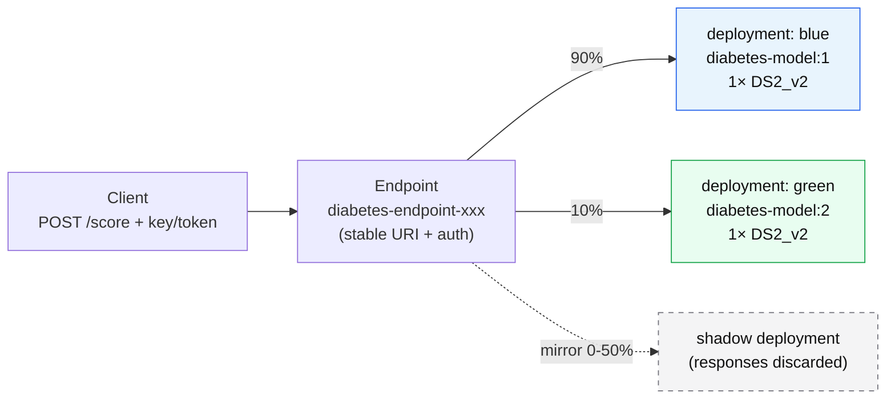

# Lab 10 — Real-time Inference with Managed Online Endpoints

**Exam mapping:** *Implement ML model lifecycle and operations* → "Deploy models as real-time endpoints with managed inference options", "Test and troubleshoot model endpoints", "Implement progressive rollout and safe rollback strategies"

**Time:** ~75 minutes | **Cost:** ⚠️ deployments bill per instance-hour **while they exist** — the lab ends with deletion. Don't leave this running overnight.

**Prerequisites:** Labs 01–09 (`diabetes-model:1` registered).

---

## 1. Concepts

### 1.1 Endpoint vs. deployment — the separation that enables everything

An **endpoint** is a stable HTTPS URI + auth. A **deployment** is a set of scored-model replicas (model + environment + compute) *behind* an endpoint. One endpoint can front several deployments, with **traffic percentages** deciding who serves what:



This split is what makes **blue-green rollout** trivial: deploy `green` at 0%, test it directly, shift 10% → 50% → 100%, delete `blue`. **Rollback** = set traffic back to `blue` (seconds, no redeploy). **Mirrored (shadow) traffic** sends a copy of live requests to a deployment without returning its responses — validation under real load with zero user risk.

### 1.2 Managed vs. Kubernetes inference

| | **Managed online endpoint** | **Kubernetes online endpoint** |
|---|---|---|
| Infra | Azure-managed VMs, OS patching, autoscale | Your AKS/Arc cluster |
| When | Default choice | Org standardizes on K8s / on-prem |

The exam's "managed inference options" = managed online endpoints (this lab) + batch endpoints (Lab 11).

### 1.3 What a deployment needs

Because `diabetes-model` is an **MLflow model**, Azure ML auto-generates the scoring script and environment (no-code deploy). A `custom_model` would additionally need:

- `code_configuration`: a `score.py` implementing `init()` (load model) and `run(raw_data)` (predict)
- `environment`: with `azureml-inference-server-http` installed

### 1.4 Auth & troubleshooting toolbox

- **Auth modes:** `key` (static keys), `aml_token` (short-lived tokens), `aad_token` (Microsoft Entra, recommended for services).
- **Troubleshooting order:** deployment `provisioning_state` → **container logs** (`az ml online-deployment get-logs`) → local deployment (`--local`) → common causes: missing package in env, scoring script errors, insufficient `instance_type` memory, ACR/image pull failures (check the `storage-initializer` logs with `--container storage-initializer`).

---

## 2. Steps

### Step 1 — Create the endpoint

Endpoint names must be **unique per region**. Create `infra/endpoint.yml`:

```yaml
$schema: https://azuremlschemas.azureedge.net/latest/managedOnlineEndpoint.schema.json
name: diabetes-ep-<your-initials>-001    # make this globally unique-ish
auth_mode: key
description: Real-time diabetes risk scoring
```

```bash
az ml online-endpoint create --file infra/endpoint.yml
```

### Step 2 — Create the `blue` deployment (no-code, MLflow model)

Create `infra/deployment-blue.yml`:

```yaml
$schema: https://azuremlschemas.azureedge.net/latest/managedOnlineDeployment.schema.json
name: blue
endpoint_name: diabetes-ep-<your-initials>-001
model: azureml:diabetes-model:1
instance_type: Standard_DS2_v2
instance_count: 1
```

No environment, no scoring script — the MLflow signature drives both. Deploy and route all traffic:

```bash
az ml online-deployment create --file infra/deployment-blue.yml --all-traffic
```

This takes ~8–15 minutes (image build + VM provisioning). Meanwhile, read Step 3.

### Step 3 — Understand what you'd write for a custom model (read-only)

```python
# score.py — only needed for custom_model deployments (NOT used in this lab)
import json, os
import joblib

def init():
    global model
    model_path = os.path.join(os.environ["AZUREML_MODEL_DIR"], "model.pkl")
    model = joblib.load(model_path)

def run(raw_data):
    data = json.loads(raw_data)["data"]
    return model.predict(data).tolist()
```

`init()` runs once per replica at startup; `run()` per request. `AZUREML_MODEL_DIR` is where the registered model is mounted.

### Step 4 — Test the endpoint

```bash
EP=diabetes-ep-<your-initials>-001

# 1. Built-in invoke (uses the payload in data/sample-request.json)
az ml online-endpoint invoke --name $EP --request-file data/sample-request.json

# 2. Raw REST — what real clients do
SCORING_URI=$(az ml online-endpoint show -n $EP --query scoring_uri -o tsv)
KEY=$(az ml online-endpoint get-credentials -n $EP --query primaryKey -o tsv)
curl -s -X POST "$SCORING_URI" \
  -H "Authorization: Bearer $KEY" \
  -H "Content-Type: application/json" \
  -d @data/sample-request.json
```

Expected: `[1, 0]` — the high-risk patient flagged, the low-risk one not.

> **MLflow payload format:** `{"input_data": {"columns": [...], "index": [...], "data": [[...]]}}` — column names must match the model signature. A bare `{"data": [...]}` is the *custom* scoring-script convention. Mixing them up is a classic troubleshooting question.

### Step 5 — Troubleshoot deliberately

```bash
# Container logs (scoring server stdout — your first stop on 5xx)
az ml online-deployment get-logs --endpoint-name $EP --name blue --lines 50

# Break a request on purpose: edit a copy of sample-request.json to
# remove the "Age" column → invoke → observe the 4xx signature-validation
# error. Signature validation is an MLflow-deployment benefit.
```

### Step 6 — Progressive rollout (blue-green)

Register the Lab 05 baseline as version 2 if you didn't in Lab 09 (any second version works), then create `green`:

```bash
sed 's/name: blue/name: green/; s/diabetes-model:1/diabetes-model:2/' \
  infra/deployment-blue.yml > infra/deployment-green.yml
az ml online-deployment create --file infra/deployment-green.yml
```

`green` starts with **0% traffic**. Test it in isolation, then shift gradually:

```bash
# Direct-test green without exposing users to it:
az ml online-endpoint invoke --name $EP --deployment-name green \
  --request-file data/sample-request.json

# Canary: 10% of live traffic
az ml online-endpoint update --name $EP --traffic "blue=90 green=10"

# Optionally: mirror 20% to green instead (responses discarded)
# az ml online-endpoint update --name $EP --mirror-traffic "green=20"

# Promote fully / roll back instantly
az ml online-endpoint update --name $EP --traffic "blue=0 green=100"
az ml online-endpoint update --name $EP --traffic "blue=100 green=0"   # ← rollback
```

> **Safe-rollback recipe the exam wants:** keep the old deployment alive at 0% until the new one has soaked; rollback is then a traffic update, not a redeploy.

### Step 7 — Autoscaling (know where it lives)

Managed online deployments integrate with **Azure Monitor autoscale**: rules scale `instance_count` on CPU/GPU utilization or request metrics. Portal: endpoint's deployment → **Scaling**. No need to configure it now; know it's Azure Monitor-based, per-deployment.

### Step 8 — Clean up (do not skip)

```bash
az ml online-endpoint delete --name $EP --yes
```

Deleting the endpoint deletes all its deployments and stops billing.

---

## 3. Verify

- [ ] Both invoke paths returned predictions; you inspected container logs
- [ ] You shifted traffic 90/10 and back, and direct-tested `green` at 0%
- [ ] Endpoint deleted

## 4. Key takeaways

1. Endpoint (URI + auth) ≠ deployment (model + compute); traffic splitting between deployments is the rollout/rollback mechanism.
2. MLflow models deploy **without code**; payloads must match the signature (`input_data` format).
3. Troubleshoot in order: provisioning state → `get-logs` → local deployment; mirrored traffic validates under real load risk-free.

## 5. Docs

- [Online endpoints concept](https://learn.microsoft.com/azure/machine-learning/concept-endpoints-online)
- [Deploy an MLflow model to online endpoints](https://learn.microsoft.com/azure/machine-learning/how-to-deploy-mlflow-models-online-endpoints)
- [Safe rollout of online endpoints](https://learn.microsoft.com/azure/machine-learning/how-to-safely-rollout-online-endpoints)
- [Troubleshoot online endpoints](https://learn.microsoft.com/azure/machine-learning/how-to-troubleshoot-online-endpoints)

**Next:** [Lab 11 — Batch Endpoints](lab-11-batch-endpoints.md)
