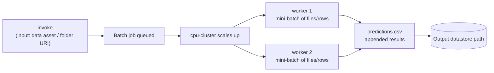

# Lab 11 — Batch Inference with Batch Endpoints

**Exam mapping:** *Implement ML model lifecycle and operations* → "Deploy models as … batch endpoints with managed inference options", "Test and troubleshoot model endpoints"

**Time:** ~45 minutes | **Cost:** minutes of cluster time per scoring job; a batch endpoint itself costs **nothing** while idle

**Prerequisites:** Labs 01–10 (`diabetes-model:1`, `cpu-cluster`).

---

## 1. Concepts

### 1.1 Online vs. batch — the decision the exam loves

| | Online endpoint (Lab 10) | Batch endpoint (this lab) |
|---|---|---|
| Pattern | Request/response, low latency | Asynchronous **job** over a dataset |
| Invocation | HTTPS call returns predictions | HTTPS call **enqueues a job**; results land in storage |
| Compute | Dedicated replicas, always on (billing!) | Compute cluster / serverless, **scales to zero** |
| Fit | Fraud check in a payment flow | Nightly scoring of the whole patient roster |

> Rule of thumb: does a human/system *wait* for the answer? → online. Is it a scheduled/bulk workload? → batch.

### 1.2 How a batch scoring job runs



The deployment defines *parallelization*: `instance_count` (nodes) × `max_concurrency_per_instance` (processes per node), with `mini_batch_size` controlling how much data each process handles per call. Failures are governed by `error_threshold` and `retry_settings` — a few bad files need not kill the whole job.

For **MLflow models**, batch deployments are no-code as well: Azure ML supplies the driver that reads tabular files, calls `predict`, and appends `predictions.csv`. Custom models supply a scoring script with `init()` / `run(mini_batch)` (note: `run` receives a *list of file paths* in batch, not a request body).

### 1.3 Deployments default, too

Like online endpoints, a batch endpoint can host multiple deployments; one is marked **default** and serves invocations unless the caller names another — same promote/rollback logic, minus traffic percentages (a job goes to exactly one deployment).

---

## 2. Steps

### Step 1 — Create the batch endpoint + deployment

`infra/batch-endpoint.yml`:

```yaml
$schema: https://azuremlschemas.azureedge.net/latest/batchEndpoint.schema.json
name: diabetes-batch-<your-initials>-001
description: Nightly bulk scoring of patient records
```

`infra/batch-deployment.yml`:

```yaml
$schema: https://azuremlschemas.azureedge.net/latest/modelBatchDeployment.schema.json
name: default-dep
endpoint_name: diabetes-batch-<your-initials>-001
type: model
model: azureml:diabetes-model:1
compute: azureml:cpu-cluster
resources:
  instance_count: 1
settings:
  max_concurrency_per_instance: 2
  mini_batch_size: 2            # files per scoring call
  output_file_name: predictions.csv
  retry_settings:
    max_retries: 3
    timeout: 300
  error_threshold: -1           # -1 = ignore file-level failures, score what you can
  logging_level: info
```

```bash
az ml batch-endpoint create --file infra/batch-endpoint.yml
az ml batch-deployment create --file infra/batch-deployment.yml --set-default
```

> `--set-default` marks this deployment as the one invocations hit. Creation is fast — nothing is provisioned until a job runs.

### Step 2 — Prepare unlabeled input data

Batch scoring input shouldn't contain the label. Create it and register:

```bash
mkdir -p data/batch-input
python3 - <<'EOF'
import csv
with open("data/diabetes-drift.csv") as f:
    rows = list(csv.reader(f))
header, body = rows[0][:-1], [r[:-1] for r in rows[1:]]   # drop 'Diabetic'
# split into 4 files to demonstrate mini-batch parallelism
n = len(body) // 4
for i in range(4):
    with open(f"data/batch-input/patients-{i}.csv", "w", newline="") as out:
        w = csv.writer(out); w.writerow(header); w.writerows(body[i*n:(i+1)*n])
EOF

az ml data create --name diabetes-batch-input --version 1 \
  --type uri_folder --path data/batch-input
```

### Step 3 — Invoke (this *starts a job*, it doesn't return predictions)

```bash
BEP=diabetes-batch-<your-initials>-001
JOB=$(az ml batch-endpoint invoke --name $BEP \
  --input azureml:diabetes-batch-input:1 \
  --query name -o tsv)
echo "scoring job: $JOB"
az ml job stream --name $JOB
```

Watch the cluster scale up, process 4 files as mini-batches, and write results. In Studio the job appears under **Jobs** (it's a pipeline job wrapping the parallel scoring step).

### Step 4 — Fetch the results

```bash
az ml job download --name $JOB --output-name score --download-path ./batch-results
head -5 batch-results/named-outputs/score/predictions.csv
```

Each row: input row index, prediction, source file — appended across all mini-batches.

### Step 5 — Invoke via REST (how schedulers call it)

```bash
SCORING_URI=$(az ml batch-endpoint show -n $BEP --query scoring_uri -o tsv)
TOKEN=$(az account get-access-token --resource https://ml.azure.com --query accessToken -o tsv)
curl -s -X POST "$SCORING_URI" \
  -H "Authorization: Bearer $TOKEN" -H "Content-Type: application/json" \
  -d '{"properties": {"InputData": {"uriFolderInput": {
        "JobInputType": "UriFolder",
        "Uri": "azureml://datastores/workspaceblobstore/paths/<path-to-batch-input>"
      }}}}'
```

> **Exam point:** batch endpoints use **Microsoft Entra tokens** (`az account get-access-token`), not static keys — there is no key auth on batch endpoints. The REST response is a job reference; poll the job for completion.

### Step 6 — Troubleshooting knowledge

- Job failed on some files? Check the job's **logs/user/** per-mini-batch logs; loosen `error_threshold` or fix inputs.
- Predictions missing columns you expected? The MLflow batch driver only outputs predictions + row refs — for enriched output, use a custom scoring script deployment.
- Also possible: deploy a **pipeline component** behind a batch endpoint (type: `pipeline` deployment) — for multi-step batch workflows (prep → score → post-process) invoked as one endpoint.

### Step 7 — Clean up (optional)

A batch endpoint is free while idle; delete only if you want a tidy workspace:

```bash
az ml batch-endpoint delete --name $BEP --yes
```

---

## 3. Verify

- [ ] Scoring job completed; `predictions.csv` downloaded with ~2000 predictions
- [ ] You can explain `mini_batch_size` × `max_concurrency_per_instance` × `instance_count`
- [ ] You know batch invocations are Entra-token-authenticated jobs, not synchronous calls

## 4. Key takeaways

1. Batch endpoints turn scoring into **asynchronous, parallel jobs** on scale-to-zero compute — the cost-efficient pattern for bulk workloads.
2. MLflow models get a no-code batch driver; custom models implement `run(mini_batch: list[str])`.
3. Default deployment (not traffic %) selects which deployment serves an invocation.

## 5. Docs

- [Batch endpoints concept](https://learn.microsoft.com/azure/machine-learning/concept-endpoints-batch)
- [Deploy MLflow models to batch endpoints](https://learn.microsoft.com/azure/machine-learning/how-to-mlflow-batch)
- [Customize outputs / scoring scripts for batch](https://learn.microsoft.com/azure/machine-learning/how-to-deploy-model-custom-output)

**Next:** [Lab 12 — Model Monitoring & Data Drift](lab-12-model-monitoring-and-drift.md)
