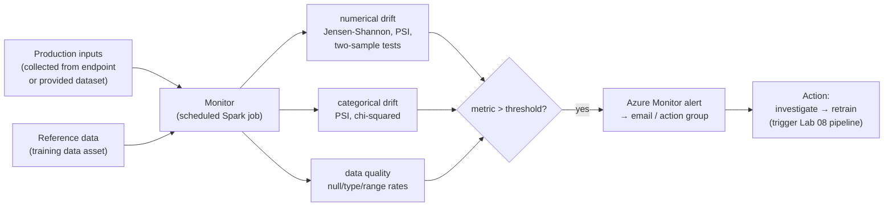

# Lab 12 — Model Monitoring, Data Drift & Retraining Triggers

**Exam mapping:** *Implement ML model lifecycle and operations* → "Detect and analyze data drift", "Monitor performance metrics of models deployed to production", "Configure retraining or alert triggers when thresholds are exceeded"

**Time:** ~60 minutes | **Cost:** monitoring jobs run on serverless Spark per schedule tick (small); an online endpoint if you keep one for production-data collection

**Prerequisites:** Labs 01–11. The `diabetes-csv:2` (drifted) data asset from Lab 02 is the star of this lab.

---

## 1. Concepts

### 1.1 Why models rot

A model is a snapshot of the world at training time. Production degrades it through:

| Signal | Definition | Example here |
|---|---|---|
| **Data drift** | Input feature distributions shift: P(X) changes | Patient population gets older/heavier (our drift dataset) |
| **Prediction drift** | Output distribution shifts: P(ŷ) changes | Positive-prediction rate jumps 46%→75% |
| **Concept drift** | The X→y relationship itself changes: P(y\|X) changes | A new medication changes how glucose predicts diabetes |
| **Data-quality issues** | Nulls, type mismatches, out-of-range values | An upstream schema change sends BMI as string |
| **Feature attribution drift** | Which features *matter* changes | BMI overtakes glucose in importance |

Ground-truth labels usually arrive **late** (a diabetes diagnosis takes months). Drift metrics are the **early-warning proxy** you can compute immediately — that's the whole point.

### 1.2 How Azure ML model monitoring works



A **monitor** = reference dataset + production dataset + signals (drift/quality/attribution) + metric thresholds + a schedule. Each tick runs a serverless Spark job that computes the metrics, publishes results to the workspace **Monitoring** UI, and raises **Azure Monitor alerts** on threshold breaches.

Production data comes from either:
- **Data collection** on a managed online endpoint (`data_collector` block logs inputs/outputs to blob storage), or
- Any **data asset** you point at (our approach — no endpoint needed to learn the mechanics).

### 1.3 Closing the loop: retraining triggers

Alert → action is glue you configure, and the exam wants the pattern, not one blessed product:
- Azure Monitor **alert rule** → **action group** → email/Teams/webhook
- Webhook → **Logic App / Azure Function / GitHub Actions `repository_dispatch`** → submit the Lab 08 training pipeline
- Threshold discipline: retrain on *sustained* drift, not single spikes (alerts support evaluation windows).

---

## 2. Steps

### Step 1 — See the drift with your own eyes first

```bash
python3 - <<'EOF'
import csv, statistics as st
def stats(path):
    rows = list(csv.DictReader(open(path)))
    return {c: round(st.mean(float(r[c]) for r in rows), 1)
            for c in ("PlasmaGlucose", "BMI", "Age")} | \
           {"positive_rate": round(sum(int(r["Diabetic"]) for r in rows)/len(rows), 2)}
print("training  :", stats("data/diabetes.csv"))
print("production:", stats("data/diabetes-drift.csv"))
EOF
```

Glucose ≈ +20, BMI ≈ +4, older population, positive rate 0.46 → 0.75. That's the drift the monitor must catch.

### Step 2 — Register production data as an MLTable

Monitoring works on tabular (mltable) inputs. Reuse the pattern from Lab 02:

```bash
mkdir -p data/production-mltable
cp data/diabetes-drift.csv data/production-mltable/
sed 's/diabetes.csv/diabetes-drift.csv/' data/diabetes-mltable/MLTable > data/production-mltable/MLTable
az ml data create --name diabetes-production --version 1 --type mltable --path data/production-mltable
```

### Step 3 — Define the monitor

Create `infra/monitor.yml`:

```yaml
$schema: https://azuremlschemas.azureedge.net/latest/monitorSchedule.schema.json
name: diabetes-drift-monitor
display_name: Diabetes model drift monitor

trigger:
  type: recurrence
  frequency: day          # daily evaluation
  interval: 1
  schedule:
    hours: 7
    minutes: 0

create_monitor:
  compute:
    instance_type: standard_e4s_v3
    runtime_version: "3.4"
  monitoring_signals:
    data_drift_signal:
      type: data_drift
      production_data:
        input_data:
          type: mltable
          path: azureml:diabetes-production:1
        data_context: model_inputs
      reference_data:
        input_data:
          type: mltable
          path: azureml:diabetes-table:1
        data_context: training
      features:
        top_n_feature_importance: 5     # only monitor the features that matter
      metric_thresholds:
        numerical:
          jensen_shannon_distance: 0.1
        categorical:
          pearsons_chi_squared_test: 0.02
    data_quality_signal:
      type: data_quality
      production_data:
        input_data:
          type: mltable
          path: azureml:diabetes-production:1
        data_context: model_inputs
      reference_data:
        input_data:
          type: mltable
          path: azureml:diabetes-table:1
        data_context: training
      metric_thresholds:
        numerical:
          null_value_rate: 0.01
          out_of_bounds_rate: 0.05
  alert_notification:
    emails:
      - Manoj.Nair@outlook.com
```

Note the vocabulary: **signals** (data_drift, data_quality, prediction_drift, feature_attribution_drift), **metrics** per signal (Jensen-Shannon distance, PSI, null rate…), **thresholds** per metric, **alert notification** on breach.

```bash
az ml schedule create --file infra/monitor.yml
```

> `top_n_feature_importance` requires feature-importance info; if creation complains, replace that block with an explicit list: `features: [PlasmaGlucose, BMI, Age, SerumInsulin]`. Also note a monitor is literally a **schedule** resource — `az ml schedule list` shows it.

### Step 4 — Run it now instead of waiting for 07:00

```bash
az ml schedule trigger --name diabetes-drift-monitor   # if your CLI version lacks `trigger`, wait for the tick or set the schedule a few minutes ahead
```

The monitoring run appears under **Jobs** (Spark job). When it finishes: Studio → **Monitoring** → `diabetes-drift-monitor` →

1. Overall drift summary — expect **PlasmaGlucose, BMI, Age flagged** (Jensen-Shannon > 0.1).
2. Per-feature view — compare reference vs. production histograms.
3. Data-quality signal — should pass (our drifted data is clean, just shifted).

An email lands at the configured address when thresholds are exceeded.

### Step 5 — Wire an alert to action (concept walkthrough)

In the Azure portal → your workspace resource → **Alerts**: the monitor's breaches surface as Azure Monitor alerts. Create an **action group** with a webhook pointing at a GitHub Actions `repository_dispatch` URL, and your Lab 13 workflow can submit `jobs/pipeline-job.yml` — that's the full retraining loop. (You'll build the GitHub Actions side in Lab 13; connect these mentally now.)

### Step 6 — Endpoint-based collection (know the YAML)

For a real deployed model you'd collect production data at the endpoint instead of registering assets by hand — one block in the online deployment YAML from Lab 10:

```yaml
data_collector:
  collections:
    model_inputs:
      enabled: "true"
    model_outputs:
      enabled: "true"
```

Inputs/outputs then stream to blob storage as MLTable-ready data, and the monitor's `production_data` points at the collector output with `data_context: model_inputs` / `model_outputs`. **Performance metrics** (latency, requests, errors) come from the endpoint's **Application Insights/Azure Monitor** metrics — different pipe than drift monitoring; know both exist.

### Step 7 — Clean up

```bash
az ml schedule disable --name diabetes-drift-monitor
```

---

## 3. Verify

- [ ] Monitoring run completed and flagged drift on glucose/BMI/age
- [ ] You can name the four monitoring signal types and one metric for each
- [ ] You can sketch alert → action group → webhook → retraining pipeline

## 4. Key takeaways

1. Drift metrics (JS distance, PSI) are the early warning you get **before** ground-truth labels exist.
2. A monitor = reference + production data + signals + thresholds + schedule; breaches raise Azure Monitor alerts.
3. Retraining triggers are alert-driven glue into the pipeline from Lab 08; operational metrics (latency/errors) live in App Insights, separate from drift.

## 5. Docs

- [Model monitoring concept](https://learn.microsoft.com/azure/machine-learning/concept-model-monitoring)
- [Configure model monitoring](https://learn.microsoft.com/azure/machine-learning/how-to-monitor-model-performance)
- [Data collection from endpoints](https://learn.microsoft.com/azure/machine-learning/how-to-collect-production-data)
- [Monitor online endpoints (App Insights)](https://learn.microsoft.com/azure/machine-learning/how-to-monitor-online-endpoints)

**Next:** [Lab 13 — IaC, GitHub Actions & Network Security](lab-13-iac-github-actions-and-network-security.md)
