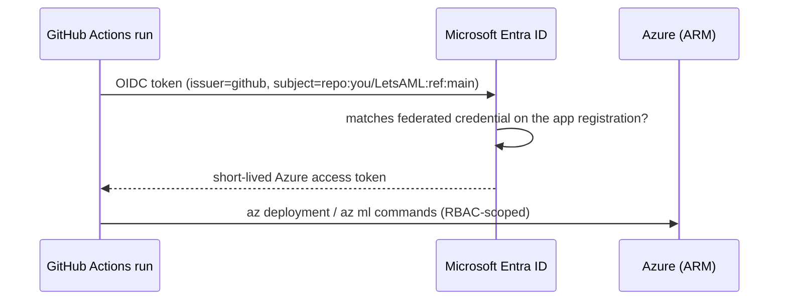

# Lab 13 — IaC with Bicep, GitHub Actions & Network Security

**Exam mapping:** *Design and implement an MLOps infrastructure* → "Deploy ML workspaces and resources by using Bicep and Azure CLI", "Configure GitHub integration to enable secure access", "Automate resource provisioning by using GitHub Actions workflows", "Restrict network access to ML workspaces", "Manage source control for machine learning projects by using Git"

**Time:** ~90 minutes | **Cost:** the Bicep-deployed test workspace is free while empty; delete its resource group at the end. A managed VNet workspace with private endpoints has small hourly costs — the network section is optional-deploy.

**Prerequisites:** Labs 01–12; a GitHub account.

---

## 1. Concepts

### 1.1 Why IaC for ML

Your workspace was clicked into existence once. IaC (Bicep templates + Azure CLI, driven by GitHub Actions) makes environments **reproducible** (dev/test/prod identical), **reviewable** (infra changes are PRs), and **recoverable**. On the exam, IaC questions are Bicep + `az deployment` + GitHub Actions with **OIDC federated credentials**.

### 1.2 The secure-access model: OIDC, not secrets

The old way stored a service-principal *password* in GitHub secrets. The current way is **workload identity federation (OIDC)**: GitHub issues a short-lived token per workflow run; Microsoft Entra trusts tokens matching your repo/branch/environment; no long-lived secret exists anywhere.



### 1.3 Network isolation options

| Option | What it does | Effort |
|---|---|---|
| `public_network_access: Disabled` + **private endpoint** | Workspace API reachable only inside your VNet | You manage the VNet |
| **Managed virtual network** (`isolation_mode`) | Azure ML creates/manages the VNet around your computes/endpoints | Recommended; two modes: `allow_internet_outbound` / `allow_only_approved_outbound` |

With `allow_only_approved_outbound`, egress is limited to required services plus your explicit **outbound rules** (private endpoints to storage/Key Vault, FQDN rules for e.g. pypi). Data exfiltration protection is the driving scenario.

### 1.4 Git for ML projects

Nothing exotic — standard Git discipline applied to ML: code + YAML + pipeline definitions in the repo (data and models stay in the workspace as versioned assets, *referenced* by name:version). Branch → PR → CI validates (lint, unit tests, maybe a smoke training job) → merge to main triggers training/deployment workflows. A compute instance can hold Git credentials for in-Studio cloning.

---

## 2. Steps

### Step 1 — Initialize the repo (source control bullet, done properly)

```bash
cd ~/PycharmProjects/LetsAML
git init -b main
cat > .gitignore <<'EOF'
.venv/
__pycache__/
batch-results/
config.json          # contains subscription/workspace ids
.amlignore
EOF
git add . && git commit -m "AI-300 labs: code, data, jobs, infra"
```

Create a GitHub repo and push:

```bash
gh repo create LetsAML --private --source . --push    # or add a remote manually
```

### Step 2 — Author a Bicep template for a workspace

Create `infra/main.bicep`:

```bicep
@description('Base name for all resources')
param baseName string
param location string = resourceGroup().location

resource storage 'Microsoft.Storage/storageAccounts@2023-05-01' = {
  name: '${baseName}st'
  location: location
  sku: { name: 'Standard_LRS' }
  kind: 'StorageV2'
  properties: {
    allowBlobPublicAccess: false
    minimumTlsVersion: 'TLS1_2'
  }
}

resource keyVault 'Microsoft.KeyVault/vaults@2023-07-01' = {
  name: '${baseName}kv'
  location: location
  properties: {
    tenantId: subscription().tenantId
    sku: { family: 'A', name: 'standard' }
    enableRbacAuthorization: true
  }
}

resource appInsights 'Microsoft.Insights/components@2020-02-02' = {
  name: '${baseName}ai'
  location: location
  kind: 'web'
  properties: { Application_Type: 'web' }
}

resource workspace 'Microsoft.MachineLearningServices/workspaces@2024-10-01' = {
  name: '${baseName}mlw'
  location: location
  identity: { type: 'SystemAssigned' }
  properties: {
    friendlyName: 'IaC-deployed workspace'
    storageAccount: storage.id
    keyVault: keyVault.id
    applicationInsights: appInsights.id
    publicNetworkAccess: 'Enabled'   // flip to 'Disabled' + managedNetwork for isolation
    // managedNetwork: { isolationMode: 'AllowInternetOutbound' }
  }
}

resource cluster 'Microsoft.MachineLearningServices/workspaces/computes@2024-10-01' = {
  parent: workspace
  name: 'cpu-cluster'
  location: location
  properties: {
    computeType: 'AmlCompute'
    properties: {
      vmSize: 'Standard_DS11_v2'
      scaleSettings: {
        minNodeCount: 0
        maxNodeCount: 2
        nodeIdleTimeBeforeScaleDown: 'PT120S'
      }
    }
  }
}

output workspaceName string = workspace.name
```

Read it against Lab 01 §1.1: the template *is* the associated-resources diagram in code (ACR omitted — created lazily). The compute child resource shows that computes are ARM resources too.

### Step 3 — Deploy with Azure CLI

```bash
az group create --name rg-letsaml-iac --location <your-region>
az deployment group create \
  --resource-group rg-letsaml-iac \
  --template-file infra/main.bicep \
  --parameters baseName=letsaml$RANDOM

# verify, then note: re-running the deployment is a no-op (idempotency — the point of IaC)
az ml workspace list --resource-group rg-letsaml-iac -o table
```

### Step 4 — Configure OIDC federation for GitHub

```bash
# 1. App registration + service principal
APP_ID=$(az ad app create --display-name letsaml-github-oidc --query appId -o tsv)
az ad sp create --id $APP_ID

# 2. Federated credential trusting your repo's main branch
az ad app federated-credential create --id $APP_ID --parameters '{
  "name": "letsaml-main",
  "issuer": "https://token.actions.githubusercontent.com",
  "subject": "repo:<your-gh-user>/LetsAML:ref:refs/heads/main",
  "audiences": ["api://AzureADTokenExchange"]
}'

# 3. RBAC on the IaC resource group
az role assignment create --assignee $APP_ID --role Contributor \
  --scope $(az group show -n rg-letsaml-iac --query id -o tsv)

# 4. Store the *identifiers* (not secrets!) in GitHub
gh secret set AZURE_CLIENT_ID --body $APP_ID
gh secret set AZURE_TENANT_ID --body $(az account show --query tenantId -o tsv)
gh secret set AZURE_SUBSCRIPTION_ID --body $(az account show --query id -o tsv)
```

> Note what is *not* stored: any password. The `subject` string is the security boundary — only workflows on `main` of your repo can redeem tokens. Per-environment federated credentials (`environment:production`) gate prod deploys behind GitHub environment approvals.

### Step 5 — GitHub Actions workflow: provision + train

Create `.github/workflows/mlops.yml`:

```yaml
name: mlops
on:
  push:
    branches: [main]
    paths: ["infra/**", "src/**", "jobs/**"]
  workflow_dispatch:        # manual trigger
  repository_dispatch:      # ← webhook target for the Lab 12 retraining alert
    types: [drift-detected]

permissions:
  id-token: write           # REQUIRED for OIDC
  contents: read

jobs:
  provision:
    runs-on: ubuntu-latest
    steps:
      - uses: actions/checkout@v4
      - uses: azure/login@v2
        with:
          client-id: ${{ secrets.AZURE_CLIENT_ID }}
          tenant-id: ${{ secrets.AZURE_TENANT_ID }}
          subscription-id: ${{ secrets.AZURE_SUBSCRIPTION_ID }}
      - name: Deploy infrastructure (idempotent)
        run: |
          az deployment group create \
            --resource-group rg-letsaml-iac \
            --template-file infra/main.bicep \
            --parameters baseName=letsamlci

  train:
    needs: provision
    runs-on: ubuntu-latest
    steps:
      - uses: actions/checkout@v4
      - uses: azure/login@v2
        with:
          client-id: ${{ secrets.AZURE_CLIENT_ID }}
          tenant-id: ${{ secrets.AZURE_TENANT_ID }}
          subscription-id: ${{ secrets.AZURE_SUBSCRIPTION_ID }}
      - name: Install ml extension
        run: az extension add -n ml -y
      - name: Submit training pipeline
        run: |
          az ml job create --file jobs/pipeline-job.yml \
            --resource-group rg-letsaml-iac --workspace-name letsamlcimlw \
            --stream
```

```bash
git add .github infra && git commit -m "Add IaC + OIDC CI/CD" && git push
gh run watch
```

> The `train` job will need the data asset/components to exist in the new workspace — a real promotion flow registers them from the repo in a prior step or consumes them from a **registry** (Lab 04). If it fails on a missing asset, you've just experienced *why registries exist*; add `az ml data create`/`az ml component create` steps before the job submission to fix it.

### Step 6 — Network restriction (read, optionally deploy)

Restricting the *workspace* means, in Bicep/CLI terms:

```bicep
properties: {
  publicNetworkAccess: 'Disabled'
  managedNetwork: { isolationMode: 'AllowOnlyApprovedOutbound' }
}
```

plus a **private endpoint** so *you* can still reach it:

```bash
az network private-endpoint create --name pe-mlw -g rg-letsaml-iac \
  --vnet-name <vnet> --subnet <subnet> \
  --private-connection-resource-id <workspace-arm-id> \
  --group-id amlworkspace \
  --connection-name mlw-conn
```

Managed-VNet outbound rules (for approved-outbound mode) are workspace properties:

```bash
az ml workspace outbound-rule set --workspace-name <ws> -g <rg> \
  --rule pypi --type fqdn --destination "pypi.org"
```

Deploy this only if you want to experiment — a private workspace is awkward from a laptop without VPN/Bastion. For the exam, know: `public_network_access`, private endpoint group-id `amlworkspace`, the two isolation modes, and that **compute instances/clusters and managed endpoints get isolated by the managed VNet automatically**.

### Step 7 — Clean up the IaC environment

```bash
az group delete --name rg-letsaml-iac --yes --no-wait
```

---

## 3. Verify

- [ ] Bicep deployment created a second workspace; rerun was a no-op
- [ ] GitHub Actions run authenticated via OIDC (check the `azure/login` step logs — no secret used)
- [ ] You can explain `subject` matching in federated credentials and both managed-VNet isolation modes

## 4. Key takeaways

1. Bicep + `az deployment group create` gives idempotent, reviewable environments; computes are ARM resources you template too.
2. GitHub ↔ Azure secure access = **OIDC federated credentials** (`permissions: id-token: write`, `azure/login` with client/tenant/subscription IDs — no stored password).
3. `repository_dispatch` is the hook that turns Lab 12's drift alert into automated retraining.
4. Network isolation = disable public access + private endpoint for inbound; managed VNet isolation modes for outbound; registries/asset-registration steps make multi-workspace promotion work.

## 5. Docs

- [Create workspaces with Bicep](https://learn.microsoft.com/azure/machine-learning/how-to-create-workspace-template)
- [Use GitHub Actions with Azure ML](https://learn.microsoft.com/azure/machine-learning/how-to-github-actions-machine-learning)
- [Workload identity federation (OIDC)](https://learn.microsoft.com/entra/workload-id/workload-identity-federation)
- [Managed virtual network isolation](https://learn.microsoft.com/azure/machine-learning/how-to-managed-network)
- [Git integration for Azure ML](https://learn.microsoft.com/azure/machine-learning/concept-train-model-git-integration)

**Next:** [Lab 14 — Microsoft Foundry: GenAIOps Infrastructure](lab-14-foundry-genaiops-infrastructure.md)
