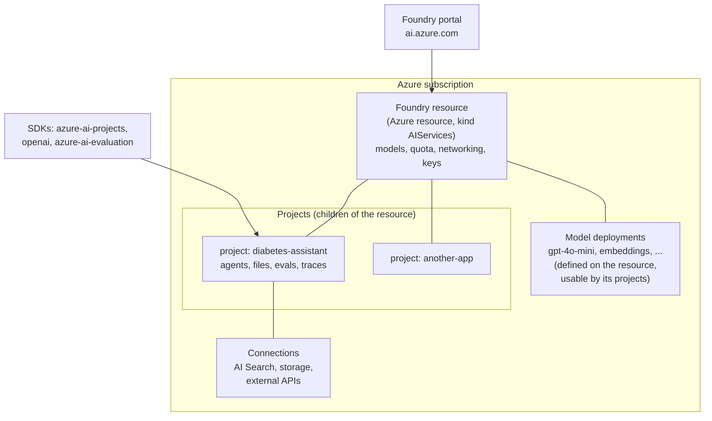

# Lab 14 — Microsoft Foundry: GenAIOps Infrastructure, Model Deployment & Prompt Management

**Exam mapping:** *Design and implement a GenAIOps infrastructure* → all four sub-areas: "Implement Foundry environments and platform configuration", "Deploy and manage foundation models for production workloads", "Implement prompt versioning and management with source control", plus PTU and networking concepts

**Time:** ~90 minutes | **Cost:** pay-per-token model calls (cents at lab scale). ⚠️ Do **not** create a provisioned (PTU) deployment — read that section only.

**Prerequisites:** Labs 01, 13 (CLI, Git repo). This lab starts the GenAI half of the exam (~50% of questions).

---

## 1. Concepts

### 1.1 Foundry in one picture

**Microsoft Foundry** (formerly Azure AI Foundry) is Azure's platform for building with foundation models — the GenAI counterpart to the ML workspace you've been using. Its resource model:



- The **Foundry resource** is the ARM-level unit: model deployments, quota, network rules, identity.
- **Projects** are workspaces for a use case: agents, evaluation runs, traces, connections.
- Two project kinds exist: **Foundry projects** (on a Foundry resource — the current default, and what the exam means) and **hub-based projects** (the older Azure ML-hub-backed kind).

### 1.2 Model deployment options — the exam's favorite GenAI table

| Option | What it is | Billing | Choose when |
|---|---|---|---|
| **Standard (pay-per-token)** | Model hosted by Azure/partner, you call an API | Per 1M input/output tokens | Default; spiky or low volume |
| **Global / Data-zone standard** | Same, with routing across regions (global) or within a data zone | Per token (cheaper, higher limits) | Throughput matters more than region pinning |
| **Provisioned (PTU)** | Reserved capacity — **provisioned throughput units** | Per PTU-hour (regardless of use) | High, steady volume; latency SLAs; predictable cost |
| **Serverless API / pay-per-token catalog models** | Partner models (Llama, Mistral…) behind Azure-hosted endpoints | Per token | Non-OpenAI models without GPUs |
| **Managed compute** | Open models on *your* GPU VMs (from the catalog) | Per VM-hour | Full control, custom weights, fine-tuned OSS |

> **PTU exam points:** PTUs are reserved model-processing capacity; you size them from expected tokens/min (the portal has a capacity calculator), they give predictable latency/throughput, can be **shared across deployments? No — per deployment**, and overflow traffic can **spillover** to a standard deployment when the provisioned queue is full.

### 1.3 Model selection & versioning

Choosing a model = balancing capability (reasoning vs. simple chat), modality, context window, latency, cost per token, region availability, and data-residency. The **model catalog** (thousands of models: Azure OpenAI, Meta, Mistral, DeepSeek, Phi…) shows benchmarks and lets you compare.

Model **versions** (e.g., a dated GPT snapshot) matter operationally: deployments pin a version and define an **upgrade policy** (auto-upgrade to default vs. pinned until you migrate). Production practice: pin versions, run evaluations (Lab 15) against the new version, then upgrade deliberately — the GenAI equivalent of blue-green.

### 1.4 Identity, RBAC, networking

Same Azure patterns as Lab 01/13, new role names:

- **Azure AI User** — use the resource: call models, run evals, use agents (data-plane).
- **Azure AI Project Manager** — manage projects, assign the User role; **Azure AI Account Owner** — full control of the account/resource.
- Services authenticate to each other via **managed identities** (e.g., the Foundry resource's identity reads an AI Search index — no keys).
- Network isolation mirrors Lab 13: `publicNetworkAccess: Disabled`, private endpoints for the account, and network-injected/standard-setup agents for private networking.

### 1.5 Prompts are code

A prompt (system message + template + few-shot examples + model parameters) determines behavior as much as code does — so it gets the same treatment: **files in Git**, PR review, versions, and **A/B comparison of variants** via evaluation (Lab 15). The **Prompty** format (`.prompty` — YAML frontmatter with model config + Jinja-style template) is the portable file format used across Foundry tooling.

---

## 2. Steps

### Step 1 — Deploy the Foundry resource + project with Bicep

Create `infra/foundry.bicep`:

```bicep
param baseName string = 'letsamlai'
param location string = resourceGroup().location

resource account 'Microsoft.CognitiveServices/accounts@2025-06-01' = {
  name: '${baseName}fdy'
  location: location
  kind: 'AIServices'
  sku: { name: 'S0' }
  identity: { type: 'SystemAssigned' }
  properties: {
    allowProjectManagement: true       // makes this a Foundry resource with projects
    customSubDomainName: '${baseName}fdy'
    publicNetworkAccess: 'Enabled'
  }
}

resource project 'Microsoft.CognitiveServices/accounts/projects@2025-06-01' = {
  parent: account
  name: 'diabetes-assistant'
  location: location
  identity: { type: 'SystemAssigned' }
  properties: { displayName: 'Diabetes patient assistant' }
}

output endpoint string = account.properties.endpoint
```

```bash
az group create -n rg-letsaml-genai -l <region-with-model-availability>   # e.g. eastus2, swedencentral
az deployment group create -g rg-letsaml-genai --template-file infra/foundry.bicep
```

> Note the resource type: Foundry resources are `Microsoft.CognitiveServices/accounts` with `kind: AIServices` + `allowProjectManagement: true`; projects are child resources. This Bicep shape is exactly what the "Deploy infrastructure using Bicep templates" exam bullet means.

Grant yourself data-plane access (Owner on the subscription doesn't imply it):

```bash
ACC_ID=$(az cognitiveservices account show -n letsamlaifdy -g rg-letsaml-genai --query id -o tsv)
az role assignment create --assignee <your-upn> --role "Azure AI User" --scope $ACC_ID
```

### Step 2 — Deploy two models (chat + embeddings)

```bash
# Chat model — substitute any current chat model available in your region
az cognitiveservices account deployment create \
  -n letsamlaifdy -g rg-letsaml-genai \
  --deployment-name chat \
  --model-name gpt-4o-mini --model-version "2024-07-18" --model-format OpenAI \
  --sku-name GlobalStandard --sku-capacity 50        # capacity = thousands of TPM

# Embedding model — needed for Lab 16 (RAG)
az cognitiveservices account deployment create \
  -n letsamlaifdy -g rg-letsaml-genai \
  --deployment-name embed \
  --model-name text-embedding-3-small --model-version "1" --model-format OpenAI \
  --sku-name GlobalStandard --sku-capacity 50

az cognitiveservices account deployment list -n letsamlaifdy -g rg-letsaml-genai -o table
```

Connect the flags to §1.2: `--sku-name` is the deployment type (`Standard`, `GlobalStandard`, `DataZoneStandard`, `ProvisionedManaged` for PTU); `--sku-capacity` is TPM quota for standard SKUs but **PTU count** for provisioned ones.

### Step 3 — Explore the portal + model catalog

Open <https://ai.azure.com> → your project. Visit:

- **Model catalog** — filter by task/provider; open a model card: benchmarks, context window, pricing, deployment options offered.
- **Playgrounds → Chat** — select deployment `chat`, try: *"What causes type 2 diabetes?"*
- **Deployments** — your two deployments; open `chat` and find the **version + upgrade policy** setting from §1.3.

### Step 4 — Call the deployment from code

```bash
pip install openai azure-identity azure-ai-projects
```

```python
# chat_test.py — keyless auth via Entra ID (the production pattern)
from openai import AzureOpenAI
from azure.identity import DefaultAzureCredential, get_bearer_token_provider

token_provider = get_bearer_token_provider(
    DefaultAzureCredential(), "https://cognitiveservices.azure.com/.default")

client = AzureOpenAI(
    azure_endpoint="https://letsamlaifdy.cognitiveservices.azure.com/",
    azure_ad_token_provider=token_provider,
    api_version="2024-10-21",
)
resp = client.chat.completions.create(
    model="chat",   # the DEPLOYMENT name, not the model name
    messages=[
        {"role": "system", "content": "You are a careful diabetes-education assistant."},
        {"role": "user", "content": "Is a fasting glucose of 110 mg/dL normal?"},
    ],
)
print(resp.choices[0].message.content)
print("tokens:", resp.usage.total_tokens)
```

> Two things the exam checks: `model=` takes the **deployment name**, and keyless (Entra) auth beats API keys in production.

### Step 5 — Put prompts under version control

Create `prompts/diabetes-assistant.prompty`:

```yaml
---
name: diabetes-assistant
description: Patient-facing diabetes education assistant
version: "1"
model:
  api: chat
  configuration:
    type: azure_openai
    azure_deployment: chat
  parameters:
    temperature: 0.2
    max_tokens: 400
inputs:
  question:
    type: string
sample:
  question: What causes type 2 diabetes?
---
system:
You are a careful diabetes-education assistant for patients.
Rules:
- Answer only from established medical guidance; if unsure, say so.
- Always advise consulting a healthcare professional for personal decisions.
- Use plain language at an 8th-grade reading level.

user:
{{question}}
```

And a **variant** to compare (`prompts/diabetes-assistant-v2.prompty`): copy it, change `version: "2"`, and make the style rule stricter (e.g., "Answer in at most 3 sentences, then one bullet of next steps"). Commit both:

```bash
git add prompts && git commit -m "Prompt v1 + concise variant v2"
```

This *is* the exam bullet "implement version control for prompts by using Git repositories": prompts as reviewable files, one variant per file/version, selection decided by **evaluation results** (you'll score these two variants against each other in Lab 15). Tag the chosen one like any release.

### Step 6 — PTU: size it, don't buy it

In the portal: **Deployments → + Deploy → your chat model → Provisioned** option (stop before creating!). Note:

- The **capacity calculator** converts expected requests/min + tokens/request into a PTU count.
- Minimum PTU counts per model family and hourly billing — why PTU is for sustained production load only.
- **Spillover**: pair a provisioned deployment with a standard one so bursts overflow instead of throttling (429s).

---

## 3. Verify

- [ ] Foundry resource + project deployed via Bicep; you hold **Azure AI User**
- [ ] `chat` and `embed` deployments respond (playground + `chat_test.py`)
- [ ] Two prompt versions committed to Git
- [ ] You can rank deployment types by cost model and name when PTU wins

## 4. Key takeaways

1. Foundry = resource (`kind: AIServices`, models/quota/network) + projects (app-level workspaces) — Bicep-deployable like everything else.
2. Deployment types: standard/global/data-zone per-token vs. **PTU reserved capacity** (predictable latency, spillover for bursts) vs. managed compute for OSS control.
3. Pin model versions; upgrade via evaluation, like blue-green.
4. Prompts live in Git as versioned files (Prompty format); variants are compared with evaluations, not vibes.

## 5. Docs

- [What is Microsoft Foundry?](https://learn.microsoft.com/azure/ai-foundry/what-is-azure-ai-foundry)
- [Create Foundry resources (Bicep)](https://learn.microsoft.com/azure/ai-foundry/how-to/create-resource-template)
- [Model deployment options](https://learn.microsoft.com/azure/ai-foundry/concepts/deployments-overview)
- [Provisioned throughput](https://learn.microsoft.com/azure/ai-foundry/openai/concepts/provisioned-throughput)
- [RBAC for Foundry](https://learn.microsoft.com/azure/ai-foundry/concepts/rbac-azure-ai-foundry)
- [Prompty format](https://learn.microsoft.com/azure/ai-foundry/how-to/develop/prompty)

**Next:** [Lab 15 — GenAI Evaluation & Observability](lab-15-genai-evaluation-and-observability.md)
