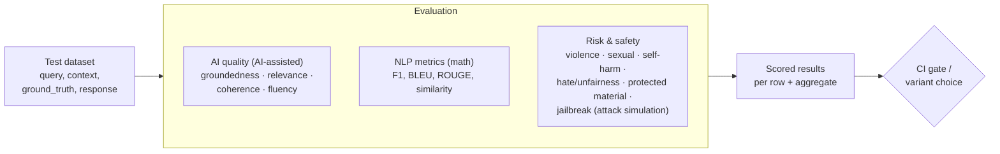

# Lab 15 — GenAI Quality Assurance: Evaluation & Observability

**Exam mapping:** *Implement generative AI quality assurance and observability* → "Create test datasets and data mapping", "Implement AI quality metrics (groundedness, relevance, coherence, fluency)", "Configure risk and safety evaluations", "Set up automated evaluation workflows", "Examine continuous monitoring in Foundry", "Monitor performance metrics", "Track and optimize cost metrics", "Configure logging, tracing, and debugging"

**Time:** ~75 minutes | **Cost:** evaluation model calls (AI-assisted metrics call the judge model per row — cents at 10 rows)

**Prerequisites:** Lab 14 (Foundry project, `chat` deployment, prompt variants). Uses `data/eval/qa-eval.jsonl` from this repo.

---

## 1. Concepts

### 1.1 Why LLM evaluation is different

Classic ML has ground truth and exact metrics (Lab 05: AUC). LLM outputs are open-ended — "correct" is fuzzy. The solution is layered:



- **AI-assisted quality metrics** use a strong LLM as judge, scoring 1–5:
  - **Groundedness** — is the answer supported by the provided *context*? (the anti-hallucination metric)
  - **Relevance** — does it address the *query*?
  - **Coherence** — is it logically consistent and well-organized?
  - **Fluency** — is the language grammatical/natural?
- **Risk & safety evaluators** detect harmful content (violence, sexual, self-harm, hate/unfairness), protected material, and vulnerability to jailbreaks — backed by the Azure AI safety-evaluation service.
- **Data mapping** connects your dataset's column names to the evaluator's expected inputs (`query`, `context`, `response`, `ground_truth`) — the `${data.column}` syntax below.

### 1.2 When to evaluate

| Stage | What runs | Purpose |
|---|---|---|
| Development | Manual + small eval sets in the playground/SDK | Pick model & prompt variant |
| Pre-production | Full eval suite in CI (GitHub Actions) | Regression gate before deploy |
| Production | **Continuous evaluation** on sampled live traffic + monitoring | Catch drift in quality/safety |

### 1.3 Observability: the three pipes

1. **Tracing** — per-request spans (prompt → tool calls → model call → response) via **OpenTelemetry**, exported to **Application Insights** connected to your project. This is your production debugger.
2. **Metrics** — latency, throughput, error rates (Azure Monitor); **token consumption** per deployment (prompt vs. completion tokens) driving **cost**.
3. **Continuous evaluation dashboards** — quality/safety scores over time in the Foundry portal's monitoring/observability pages.

Cost optimization levers to know: right-size the model (mini/nano tiers), cap `max_tokens`, **prompt caching** (repeated prompt prefixes billed at a discount), batch API for offline work (~50% cheaper), and PTU only when utilization is sustained.

---

## 2. Steps

### Step 1 — Inspect the test dataset

Open `data/eval/qa-eval.jsonl` — 10 diabetes Q&A rows, each with `query`, `context`, `ground_truth`, and a pre-filled `response`. This is the shape a "create test datasets" exam question expects: representative queries, authoritative context (for groundedness), reference answers (for similarity/F1).

### Step 2 — Run a local evaluation with the SDK

```bash
pip install azure-ai-evaluation
```

Create `run_eval.py`:

```python
import json
from azure.ai.evaluation import (
    evaluate, GroundednessEvaluator, RelevanceEvaluator,
    CoherenceEvaluator, FluencyEvaluator,
)

# AI-assisted evaluators need a judge model = your chat deployment
model_config = {
    "azure_endpoint": "https://letsamlaifdy.cognitiveservices.azure.com/",
    "azure_deployment": "chat",
    "api_version": "2024-10-21",
}

result = evaluate(
    data="data/eval/qa-eval.jsonl",
    evaluators={
        "groundedness": GroundednessEvaluator(model_config),
        "relevance": RelevanceEvaluator(model_config),
        "coherence": CoherenceEvaluator(model_config),
        "fluency": FluencyEvaluator(model_config),
    },
    # DATA MAPPING: dataset columns → evaluator inputs
    evaluator_config={
        "default": {
            "column_mapping": {
                "query": "${data.query}",
                "context": "${data.context}",
                "response": "${data.response}",
                "ground_truth": "${data.ground_truth}",
            }
        }
    },
    output_path="eval-results.json",
)
print(json.dumps(result["metrics"], indent=2))
```

```bash
python run_eval.py
```

Expect means near 4–5 (the canned responses are good). Open `eval-results.json` and find a per-row record: each metric has a **score and a reason** — the judge model explains itself. That reason field is what makes AI-assisted evaluation debuggable.

### Step 3 — Compare your two prompt variants (closing Lab 14's loop)

Generate fresh responses with each `.prompty` variant, then evaluate both files:

```python
# gen_responses.py — run each variant over the eval queries
import json
from openai import AzureOpenAI
from azure.identity import DefaultAzureCredential, get_bearer_token_provider

SYSTEMS = {
    "v1": open("prompts/diabetes-assistant.prompty").read().split("system:")[1].split("user:")[0],
    "v2": open("prompts/diabetes-assistant-v2.prompty").read().split("system:")[1].split("user:")[0],
}
client = AzureOpenAI(
    azure_endpoint="https://letsamlaifdy.cognitiveservices.azure.com/",
    azure_ad_token_provider=get_bearer_token_provider(
        DefaultAzureCredential(), "https://cognitiveservices.azure.com/.default"),
    api_version="2024-10-21",
)
rows = [json.loads(l) for l in open("data/eval/qa-eval.jsonl")]
for variant, system in SYSTEMS.items():
    with open(f"eval-{variant}.jsonl", "w") as out:
        for r in rows:
            resp = client.chat.completions.create(
                model="chat", temperature=0.2, max_tokens=400,
                messages=[{"role": "system", "content": system},
                          {"role": "user", "content": r["query"]}],
            )
            r["response"] = resp.choices[0].message.content
            out.write(json.dumps(r) + "\n")
    print(f"wrote eval-{variant}.jsonl")
```

Run `run_eval.py` against each output file (change `data=`), compare the metric means, and **commit the winner's version tag to Git**. Prompt variant comparison = generate → evaluate → pick by metrics. That's the whole GenAIOps prompt loop.

### Step 4 — Risk & safety evaluation (portal or SDK)

Safety evaluators (`ViolenceEvaluator`, `SelfHarmEvaluator`, `HateUnfairnessEvaluator`, `SexualEvaluator`, `IndirectAttackEvaluator`, …) call the Azure AI safety service, so they take your **project endpoint** + credential instead of a judge-model config:

```python
from azure.ai.evaluation import ViolenceEvaluator
from azure.identity import DefaultAzureCredential

violence = ViolenceEvaluator(
    credential=DefaultAzureCredential(),
    azure_ai_project="https://letsamlaifdy.services.ai.azure.com/api/projects/diabetes-assistant",
)
print(violence(query="Is a fasting glucose of 110 normal?",
               response="Slightly above normal; 100-125 mg/dL suggests prediabetes. See your doctor."))
```

Output: a severity label (Very low → High) + score 0–7 + reasoning. In the **Foundry portal → Evaluation**, the same evaluators run as cloud evaluation jobs over datasets, plus **AI Red Teaming / adversarial simulators** that attack your app with jailbreak attempts. Run one portal evaluation over `qa-eval.jsonl` to see the dashboard rendering (upload the file as a dataset, select quality + safety evaluators, map columns — the same mapping concept as Step 2).

### Step 5 — Automate evaluation in CI

Add to `.github/workflows/mlops.yml` (Lab 13's file) — the pattern matters more than the details:

```yaml
  genai-eval:
    runs-on: ubuntu-latest
    steps:
      - uses: actions/checkout@v4
      - uses: azure/login@v2
        with: { client-id: "${{ secrets.AZURE_CLIENT_ID }}", tenant-id: "${{ secrets.AZURE_TENANT_ID }}", subscription-id: "${{ secrets.AZURE_SUBSCRIPTION_ID }}" }
      - run: pip install azure-ai-evaluation openai azure-identity
      - name: Generate + evaluate
        run: |
          python gen_responses.py
          python run_eval.py
      - name: Quality gate
        run: |
          python - <<'EOF'
          import json, sys
          m = json.load(open("eval-results.json"))["metrics"]
          assert m.get("groundedness.groundedness", 0) >= 4.0, f"Groundedness regression: {m}"
          EOF
```

A failing groundedness mean now **blocks the deploy** — evaluation as a regression test, which is precisely "set up automated evaluation workflows".

### Step 6 — Tracing and monitoring

1. **Connect App Insights:** Foundry portal → your project → **Observability / Tracing** → attach an Application Insights resource (create one if prompted).
2. **Instrument your client:**

```bash
pip install azure-monitor-opentelemetry opentelemetry-instrumentation-openai-v2
```

```python
# traced_chat.py
import os
from azure.monitor.opentelemetry import configure_azure_monitor
from opentelemetry.instrumentation.openai_v2 import OpenAIInstrumentor

os.environ["OTEL_INSTRUMENTATION_GENAI_CAPTURE_MESSAGE_CONTENT"] = "true"  # dev only!
configure_azure_monitor(connection_string="<app-insights-connection-string>")
OpenAIInstrumentor().instrument()

# ... now run the same code as chat_test.py — every call emits a span
```

3. Make a few calls, then look in **portal → Tracing**: each request shows the full span tree (prompt, model, token counts, latency). In Application Insights, the same data answers "p95 latency last hour" via KQL.
4. **Cost/token metrics:** Azure portal → the Foundry resource → **Metrics** → *Processed Prompt Tokens* / *Generated Completion Tokens*, split by deployment. Multiply by the per-token price = your cost dashboard; alert rules on token rates catch runaway usage.

---

## 3. Verify

- [ ] Local evaluation produced per-row scores with reasons; portal evaluation rendered a dashboard
- [ ] Variant comparison picked a winner on metrics
- [ ] A safety evaluator returned severity + reasoning
- [ ] Traces visible in the portal with token counts and latency per call

## 4. Key takeaways

1. The four AI quality metrics — **groundedness** (context-supported?), **relevance** (answers the query?), **coherence**, **fluency** — are LLM-judged 1–5 with reasons; safety evaluators return severity levels via the safety service.
2. **Column/data mapping** (`${data.col}`) binds datasets to evaluators; the same eval runs locally, in the portal, and as a CI gate.
3. Observability = OpenTelemetry traces → App Insights, Azure Monitor metrics for latency/throughput, and token metrics for cost — plus continuous evaluation over live traffic.

## 5. Docs

- [Evaluation of GenAI apps (concepts)](https://learn.microsoft.com/azure/ai-foundry/concepts/evaluation-approach-gen-ai)
- [Evaluate with the Azure AI Evaluation SDK](https://learn.microsoft.com/azure/ai-foundry/how-to/develop/evaluate-sdk)
- [Risk & safety evaluators](https://learn.microsoft.com/azure/ai-foundry/concepts/evaluation-metrics-built-in)
- [Tracing & observability in Foundry](https://learn.microsoft.com/azure/ai-foundry/concepts/trace)
- [Plan and manage costs](https://learn.microsoft.com/azure/ai-foundry/how-to/costs-plan-manage)

**Next:** [Lab 16 — RAG Optimization & Fine-tuning](lab-16-rag-optimization-and-finetuning.md)
