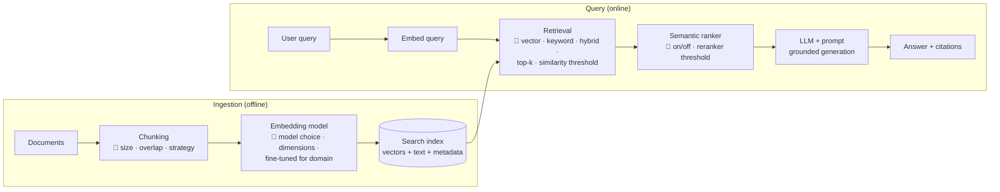

# Lab 16 — RAG Optimization & Fine-tuning

**Exam mapping:** *Optimize generative AI systems and model performance* → both sub-areas: "Optimize RAG performance and accuracy" (similarity thresholds, chunk sizes, retrieval strategies, embedding models, hybrid search, relevance metrics & A/B testing) and "Implement advanced fine-tuning and model customization" (methods, synthetic data, monitoring, dev-to-prod lifecycle)

**Time:** ~90 minutes | **Cost:** ⚠️ Azure AI Search bills while it exists — use **Basic** tier and delete at the end. Fine-tuning is discussed and optionally executed (a small fine-tune job costs a few dollars; the concepts section suffices for the exam).

**Prerequisites:** Labs 14–15 (Foundry project, `chat` + `embed` deployments, evaluation workflow).

---

## 1. Concepts

### 1.1 RAG anatomy — every tuning knob has an address



The exam's tuning bullets map to these knobs:

| Knob | Trade-off | Practical guidance |
|---|---|---|
| **Chunk size** | Small chunks = precise retrieval but fragmented context; large = coherent but diluted embeddings & wasted tokens | Start ~512 tokens with 10–25% **overlap**; chunk on document structure (headings/paragraphs) when possible |
| **top-k** | More chunks = better recall, more noise + tokens | Start 3–5; measure |
| **Similarity threshold** | High = fewer, better chunks (risk: nothing retrieved); low = noise that invites hallucination | Tune against groundedness/relevance metrics, don't guess |
| **Retrieval strategy** | **Keyword** (BM25): exact terms, ids, jargon. **Vector**: paraphrase/semantic. **Hybrid**: both, fused with **RRF** (Reciprocal Rank Fusion). | Hybrid + semantic ranker is the strongest default in Azure AI Search |
| **Semantic ranker** | Cross-encoder reranking of top results; adds latency + cost | Usually worth it; also provides a reranker score you can threshold |
| **Embedding model** | Quality vs. dimension size (storage/latency) vs. domain fit | E.g. `text-embedding-3-small/-large`; **fine-tune embeddings** when domain vocabulary defeats general models (medical abbreviations…) |

**Measure, don't vibe:** retrieval quality = relevance metrics over a labeled query set (does the right chunk appear in top-k?), plus end-to-end **groundedness/relevance** (Lab 15) — and changes ship via **A/B testing**: run config A and config B over the same eval set (or split live traffic), compare metrics, promote the winner. You already own the machinery for this: Lab 15's `evaluate()`.

### 1.2 Fine-tuning — when and how

**When RAG vs. fine-tuning?** RAG injects *knowledge* (facts that change, citations needed). Fine-tuning changes *behavior* (style, format, domain reasoning, following complex instructions with fewer prompt tokens). They combine: a fine-tuned model inside a RAG system.

Methods to know:

- **Supervised fine-tuning (SFT)** — prompt/completion pairs (JSONL); the standard method in Foundry. Uses **LoRA** (Low-Rank Adaptation) under the hood for OpenAI-family models: only small adapter matrices train, cutting cost dramatically.
- **DPO (Direct Preference Optimization)** — pairs of preferred/rejected responses; aligns tone/judgment where "good" is easier to compare than to author.
- **Distillation** — a large "teacher" model generates outputs (via **stored completions** in production) that fine-tune a small, cheap "student" model.
- **RFT (Reinforcement fine-tuning)** — reasoning-model tuning with graders scoring outputs.

**Synthetic data:** when real training examples are scarce/sensitive (patient chats!), generate them — use a strong model to produce Q&A pairs from your documents (the `azure-ai-evaluation` **Simulator** does exactly this), then human-review a sample. Synthetic eval sets similarly stress-test coverage.

**Fine-tuned model lifecycle (dev → prod):** train job (JSONL train + validation files) → inspect **loss curves/metrics** → deploy to a **developer-tier/test deployment** → run the Lab 15 evaluation suite vs. the base model → promote to a standard/provisioned deployment → **monitor** (traces, token costs, continuous eval) → retrain on new data as needed. Custom-model deployments also carry an hourly hosting charge on some tiers — a cost-model exam point.

---

## 2. Steps

### Step 1 — Stand up Azure AI Search and connect it

```bash
az search service create --name letsaml-search -g rg-letsaml-genai --sku basic --location <region>
```

In the Foundry portal → your project → **Connections** (Management center) → **+ New connection → Azure AI Search** → select the service. Prefer **Microsoft Entra ID** auth for the connection — the resource's managed identity then needs *Search Index Data Contributor* on the search service (assign it in the portal IAM blade). This is Lab 14 §1.4's managed-identity story in practice.

### Step 2 — Create a knowledge source and index

Fastest path in the portal: project → **Playgrounds → Chat → Add your data** (or **Knowledge/Indexes** depending on portal build) → upload files → it chunks, embeds (using your `embed` deployment), and builds a vector index.

For data: create `data/rag-docs/diabetes-guide.md` with ~2 pages of diabetes-care content (reuse/expand the `context` fields from `data/eval/qa-eval.jsonl` — paste them under headings like *Diagnosis*, *HbA1c*, *Diet*, *Medication*, *Gestational diabetes*). Upload it, name the index `diabetes-kb`.

Ask in the playground (with data attached): *"What HbA1c value indicates diabetes?"* — note the **citation** in the answer. Then ask something *not* in the docs and observe the refusal (grounded-only behavior).

### Step 3 — Interrogate the index like an optimizer

Azure portal → the search service → **Indexes → diabetes-kb**:

- **Fields**: find the content field, the vector field (note its **dimensions** — matches the embedding model), metadata fields.
- **Search explorer**: run the same query three ways and compare result ordering:
  1. plain keyword: `HbA1c diabetes threshold`
  2. vector-only (portal's vector search option)
  3. hybrid + semantic ranker (if enabled on the service)

  A pure-keyword query for `"6.5%"` beats vectors; a paraphrase ("long-term sugar average test") favors vectors; hybrid handles both — the §1.1 table made tangible.

### Step 4 — A/B test two RAG configurations

Wire the retrieval into code so configs are comparable. `rag_query.py`:

```python
import json
from azure.identity import DefaultAzureCredential, get_bearer_token_provider
from azure.search.documents import SearchClient
from azure.search.documents.models import VectorizableTextQuery
from openai import AzureOpenAI

cred = DefaultAzureCredential()
search = SearchClient("https://letsaml-search.search.windows.net", "diabetes-kb", cred)
client = AzureOpenAI(
    azure_endpoint="https://letsamlaifdy.cognitiveservices.azure.com/",
    azure_ad_token_provider=get_bearer_token_provider(cred, "https://cognitiveservices.azure.com/.default"),
    api_version="2024-10-21",
)

def answer(query, top_k, hybrid):
    vq = VectorizableTextQuery(text=query, k_nearest_neighbors=top_k, fields="text_vector")
    results = search.search(
        search_text=query if hybrid else None,   # text+vector = hybrid (RRF fusion)
        vector_queries=[vq], top=top_k,
    )
    context = "\n---\n".join(doc["chunk"] for doc in results)   # field names per your index
    resp = client.chat.completions.create(
        model="chat", temperature=0.2,
        messages=[
            {"role": "system", "content": "Answer ONLY from the provided context. If the context lacks the answer, say you don't know.\n\nContext:\n" + context},
            {"role": "user", "content": query},
        ],
    )
    return resp.choices[0].message.content, context

# Config A: vector-only, k=3 | Config B: hybrid, k=5
for name, cfg in {"A-vector-k3": (3, False), "B-hybrid-k5": (5, True)}.items():
    with open(f"eval-rag-{name}.jsonl", "w") as out:
        for row in map(json.loads, open("data/eval/qa-eval.jsonl")):
            resp, ctx = answer(row["query"], *cfg)
            out.write(json.dumps({**row, "response": resp, "context": ctx}) + "\n")
    print("wrote", name)
```

(Adjust `fields`/`chunk` to your index's actual field names — see Step 3.) Then score both files with Lab 15's `run_eval.py` (groundedness + relevance) and compare. **This generate-per-config → evaluate → compare loop is the "A/B testing framework" the exam bullet means.** Threshold tuning works the same way: filter retrieved results on `@search.score`/reranker score and re-run.

### Step 5 — Fine-tuning walkthrough (portal; running it is optional)

Foundry portal → **Fine-tuning → + Fine-tune model** → pick a tunable chat model:

1. **Method**: note SFT / DPO (/ RFT for reasoning models) options — map to §1.2.
2. **Training data**: requires JSONL in chat format:

```json
{"messages": [{"role": "system", "content": "You are a diabetes-education assistant."}, {"role": "user", "content": "What is HbA1c?"}, {"role": "assistant", "content": "HbA1c reflects your average blood glucose over 2-3 months. 6.5% or higher on two tests indicates diabetes."}]}
```

   To *create* such data synthetically: prompt your `chat` deployment to generate 50 Q&A pairs from `diabetes-guide.md`, review, save as `data/finetune/train.jsonl` — that's "create and manage synthetic data for fine-tuning". Keep a held-out `validation.jsonl`.
3. **Hyperparameters**: epochs, batch size, learning-rate multiplier — defaults first; watch **training vs. validation loss** for overfitting (validation loss rising = stop/reduce epochs).
4. If you run it: when the job completes, **deploy** the fine-tuned model as a new deployment (e.g., `chat-ft`), evaluate it against `chat` with Lab 15's suite, and only then would you shift traffic. Delete the `chat-ft` deployment after — custom-model deployments can bill hourly.

### Step 6 — Clean up

```bash
az search service delete --name letsaml-search -g rg-letsaml-genai --yes
# and if you're done with all GenAI labs:
# az group delete --name rg-letsaml-genai --yes
```

---

## 3. Verify

- [ ] Grounded playground answers with citations; out-of-scope questions refused
- [ ] Keyword vs. vector vs. hybrid orderings compared in Search explorer
- [ ] Two RAG configs evaluated head-to-head with metric deltas
- [ ] You can pick RAG vs. SFT vs. DPO vs. distillation for a given scenario and describe the fine-tune lifecycle

## 4. Key takeaways

1. Every RAG knob (chunk size/overlap, top-k, threshold, hybrid+RRF, semantic ranker, embedding model) is tuned **against evaluation metrics**, config-vs-config — never in isolation.
2. Hybrid search + semantic ranker is the default that survives both jargon and paraphrase; thresholds trade empty context against noisy context.
3. RAG adds knowledge; fine-tuning (SFT/LoRA, DPO, distillation) changes behavior; synthetic data fills training/eval gaps with human review.
4. A fine-tuned model is a *candidate*, not a release: evaluate vs. base, deploy progressively, monitor, retrain — the same lifecycle discipline as Labs 10–12.

## 5. Docs

- [RAG and indexes in Foundry](https://learn.microsoft.com/azure/ai-foundry/concepts/retrieval-augmented-generation)
- [Hybrid search & ranking (Azure AI Search)](https://learn.microsoft.com/azure/search/hybrid-search-overview)
- [Chunking strategies](https://learn.microsoft.com/azure/search/vector-search-how-to-chunk-documents)
- [Fine-tuning in Foundry](https://learn.microsoft.com/azure/ai-foundry/concepts/fine-tuning-overview)
- [Generate synthetic data (Simulator)](https://learn.microsoft.com/azure/ai-foundry/how-to/develop/simulator-interaction-data)

---

## 🎓 You made it

You've now touched every skill area in the AI-300 outline. Before booking the exam:

1. Re-read each lab's **Key takeaways** — they're written as answer patterns.
2. Do the free **Practice Assessment** on the [AI-300 exam page](https://learn.microsoft.com/credentials/certifications/exams/ai-300/).
3. Sweep your Azure subscription for leftovers: endpoints, compute instances, search services, model deployments, resource groups (`rg-letsaml-iac`, `rg-letsaml-genai`).
